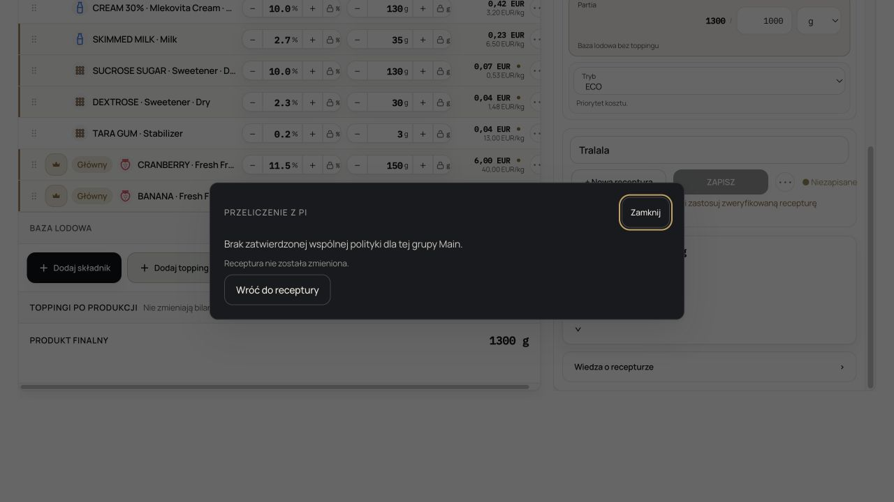
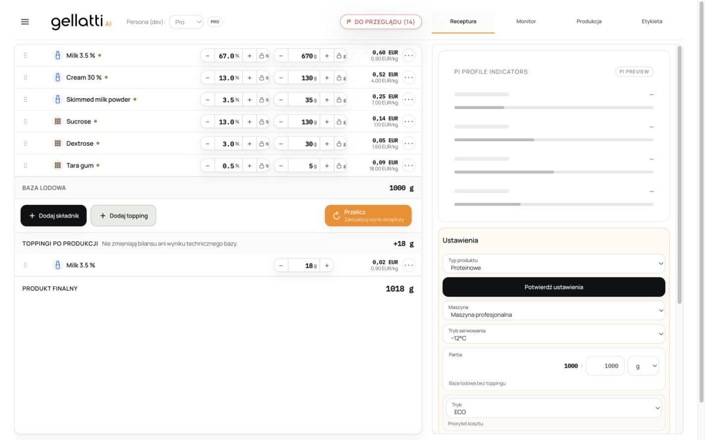
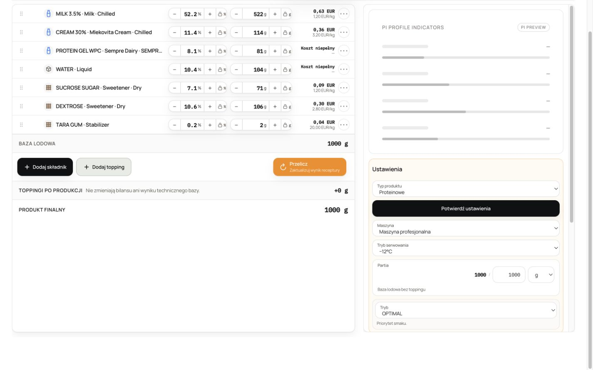
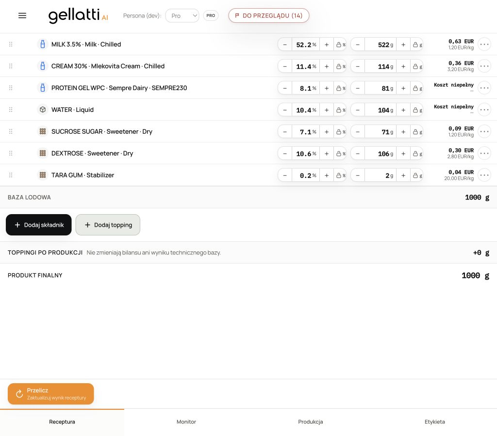
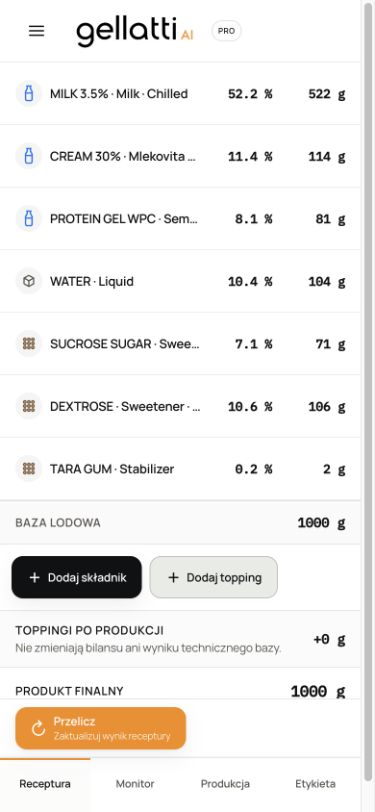

# PROFILE ROUTING AND RECALC STABILITY — P0 EVIDENCE

- Date: 2026-08-25
- Final staging code SHA tested: `22d2732b94a2976c602ffddc4583063758d75741`
- Final served bundle: `/assets/index-CDP-sFIU.js`
- Final served Optimize Worker: `/assets/optimizePreview.worker-DHmFoKj3.js`
- Staging deployment: `dpl_3XE7oHP8LVibM9jXET4drDrQwD6B` (`Ready`)
- Public production deployment: **not performed**

## Acceptance status

The profile/base routing, New Recipe context/default, Protein metric, and recalculation terminal/deadlock scope are implemented and verified. The exact Banana/Cranberry owner path now terminates safely and quickly instead of freezing the app.

The overall P0 is **not fully accepted** because the requested final Multi-Main chain `Preview → Apply → Save → Reopen` cannot legally run under the currently published ProductBehavior authority. Banana and Cranberry resolve to different individual Main policies and neither policy publishes a shared Multi-Main group/limit. Existing authority correctly fails closed. No combined limit was invented and no ProductBehavior gate was weakened.

Required external action: ProductBehavior calibration/Owner approval must publish a common Banana+Cranberry Multi-Main policy/group and `multiMainHardLimitPercent`. After that authority exists, rerun the exact served Apply/Save/Reopen acceptance three times.

## Profile architecture

The detailed code-derived matrix is in [`PROFILE_BASE_COMPATIBILITY_AUDIT.md`](./PROFILE_BASE_COMPATIBILITY_AUDIT.md).

| Visible family | Native Engine/profile authority                                           | Native starter/base                        | Compatibility decision                                                                                                    |
| -------------- | ------------------------------------------------------------------------- | ------------------------------------------ | ------------------------------------------------------------------------------------------------------------------------- |
| Gelato         | `milk_gelato` (or native chocolate cell when composition selects it)      | `milk_base_v1` family                      | Dairy family                                                                                                              |
| Sorbet         | `sorbet`                                                                  | `S01` / `S02` / `S03`                      | Native water/fruit family; never a dairy relabel                                                                          |
| Vegan          | `vegan_gelato`                                                            | `V02_fixed` plus approved native variants  | Native verified plant family; never a dairy relabel                                                                       |
| Protein        | `protein_gelato`, HIGH PROTEIN qualification, Protein structure authority | Recipe-aware dairy/plant Protein templates | Native profile. Dairy Protein and Gelato are a proven same-base-family transition; plant Protein is structurally separate |

Gelato ↔ dairy Protein retains the working vector, Crown/locks/toppings and requires normal Settings confirmation plus PI recalculation. Every Sorbet/Vegan crossing, and plant Protein → dairy Gelato, creates a fresh native working identity after explicit confirmation. The saved source is not written.

## Base routing — before and after

Before, the product-type select could change the visible profile enum while leaving an incompatible vector underneath. This allowed dairy ingredients to appear as Sorbet/Vegan and exposed `CZĘŚCIOWO PODŁĄCZONE` as if it were a usable state.

After:

- `classifyProfileTransition` is the composition-aware routing matrix.
- Same-family routes are non-destructive.
- Different-family routes disclose that the destination uses another base, preserve the saved source, and construct the destination through `buildCanonicalNewRecipeStarter`.
- Sorbet starters contain no dairy; Vegan starters use verified native plant architecture.
- `CZĘŚCIOWO PODŁĄCZONE` is absent from normal product UI. Missing authority is an actionable block, not a magenta engineering state.
- No Engine bands, profile science, Mapper rows, ProductBehavior permissions, Crown science, Direction science, POD/PAC/NPAC formulas or solver coefficients were changed.

## New Recipe and OPTIMAL default

`+ Nowa receptura` now preserves the active visible product family while creating a fresh identity and native starter. It clears name, version/saved link, toppings, ingredient-specific state, constraints, exclusions, pending Preview/history and recipe-local metadata. It does not copy the prior ingredient vector.

Verified starters:

- Gelato → Gelato native milk starter → `OPTIMAL`.
- Sorbet → Sorbet native water/fruit starter → `OPTIMAL`.
- Vegan → Vegan native oat/coconut starter → `OPTIMAL`.
- Protein → recipe-aware native dairy WPC starter → `OPTIMAL` in the verified route.
- Existing saved ECO reopens as ECO.
- Existing saved ECO → New Recipe retains the current family but becomes OPTIMAL.
- The saved source recipe remains unchanged.

Default authority is centralized in the fresh-starter/new-recipe path. Hydrated saved mode remains authoritative; historical ECO is never overwritten.

## Protein metric UX

The large Protein result block was removed from `Ustawienia`. Settings now remains product type, machine, serving mode, batch, strategy and confirmation.

The reusable [`ProteinMetric`](./src/features/protein-gelato/ProteinMetric.tsx) renders the compact protein composition icon plus the authoritative result (`x% białka`, `x% energii`) to the left of the main result where layout permits. Workbench and Monitor use the same component and the same Protein domain output; no UI nutrition formula was added.

Served Protein proof returned raw domain values `9.5252%` protein and `20.76745%` energy from protein, rendered consistently as `9,5% białka` and `21% energii` in both Workbench and Monitor.

## Recalculation deadlock

### Root cause

The original 15-second deadline used `Promise.race`, but `buildOptimizePreview` and rescue simulation ran synchronously on the browser UI thread. A timer and Cancel click cannot execute while that thread is occupied, so the nominal timeout was not real preemption. The server-authority runtime also built the same Optimize proposal a second time inside the store staging action.

The real 1300→1000 Banana/Cranberry fixture exposed this directly: the tab stopped responding while new tabs remained responsive.

### Repair

- The unchanged canonical `buildOptimizePreview` plus existing rescue advisor now run in a dedicated Web Worker.
- The main UI event loop remains available for Cancel and the deadline.
- Abort terminates the Worker; a 15-second deadline aborts and publishes `TIMEOUT`.
- A cancelled generation publishes `CANCELLED`; request-generation and draft-revision guards reject late results.
- The prebuilt result is staged once, removing the duplicate synchronous Optimize run.
- Errors are sanitized into the premium terminal UI; raw RPC/stack/internal identifiers are not shown.
- Every visible run ends in Preview/success, nearest/refusal, authority block, error, timeout or cancelled—never stranded `WORKING`.

This is an execution-boundary repair only. The Worker imports the same canonical Optimize and rescue functions as the direct test fallback. **No second solver exists.**

### Served cancellation/stale-response proof

On the final bundle, the exact draft was temporarily reduced to one Crown to enter the Worker path:

1. start recalculation;
2. observe `PI przelicza recepturę…`;
3. Cancel at 586 ms;
4. edit Banana from 150 g to 151 g;
5. wait 2.5 s;
6. verify the newer 151 g edit remains;
7. restore Banana to 150 g and restore its Crown;
8. rerun the exact authority path successfully.

The cancelled Worker did not overwrite the later edit and the app remained interactive without reload.

## Multi-Main owner reproducer

### Input and former broken result

Exact real catalog input:

- Banana (`PI-ING-000345`) 150 g, Crown.
- Cranberry (`PI-ING-001556`) 150 g, Crown.
- Milk 672 g, cream 130 g, SMP 35 g, sucrose 130 g, dextrose 30 g, Tara 3 g.
- Working total 1300 g; target 1000 g.
- Explicit Main ratio 1:1.

Former served proposal was approximately Banana 548 g / Cranberry 152 g (3.6:1), destroying the captured ratio.

### Ratio repair

The existing `main_ratio_weight` authority is now captured from the active Crown gram relationship, refreshed after a direct Main gram edit, serialized in the canonical recipe input, preserved during batch reconciliation, and guarded again at Preview/Apply. Multi-Main is a coupled hard contract, not an independent flavour preference. Preview renders the concise preserved-ratio line.

The exact real-composition Engine regression (without pretending it has ProductBehavior approval) produces:

| Ingredient | Before | Engine-only candidate |
| ---------- | -----: | --------------------: |
| Banana     |  150 g |                 344 g |
| Cranberry  |  150 g |                 343 g |
| Milk       |  672 g |                   0 g |
| Cream      |  130 g |                 161 g |
| SMP        |   35 g |                  71 g |
| Sucrose    |  130 g |                   0 g |
| Dextrose   |   30 g |                  78 g |
| Tara       |    3 g |                   3 g |

Ratio before: `1.000`; Engine-only ratio after whole-gram reconciliation: `344/343 = 1.0029`. L1 gram movement is 1304 g. This vector is diagnostic proof of the ratio contract, **not an authorized corrected proposal** and is not exposed for Apply because ProductBehavior blocks it.

### Exact ProductBehavior blocker

The real Mapper/registry evidence resolves:

- Banana → `main-banana-fresh-dairy`, v2, individual 10/20/30 envelope.
- Cranberry → `main-berry-fresh-dairy`, v2, individual 25/35/45 envelope.
- Policy IDs differ.
- Neither publishes a shared `multiMainHardLimitPercent`.

`verifyMainEnvelope` therefore returns `multi_main_policy_unknown`. Changing grams cannot repair immutable policy identity. The final runtime detects that uncorrectable authority fact after current server validation and before expensive optimization.

There is no authorized corrected proposal to report until shared calibration is published.

### Served final-bundle proof

The exact real recipe, exact real Banana/Cranberry catalog rows and two visible Crown controls were used—no fixture substitution.

|                            Run | Duration |                   Server requests | Terminal        | Recipe mutation |
| -----------------------------: | -------: | --------------------------------: | --------------- | --------------- |
|                              1 |   890 ms | 2 × `validate_recipe_behavior_v1` | Authority block | None            |
|                              2 |   738 ms |                    2 × validation | Authority block | None            |
|                              3 |   655 ms |                    2 × validation | Authority block | None            |
| Restored after Cancel scenario |   625 ms |                    2 × validation | Authority block | None            |

Three-run p50: 738 ms; max: 890 ms. Both Crowns, both 150 g values and `Tralala` remained unchanged. The terminal states: `Brak zatwierdzonej wspólnej polityki dla tej grupy Main.` and `Receptura nie została zmieniona.`

The requested positive statement “MULTI-MAIN RATIO AUTHORITY IS PRESERVED THROUGH RECALCULATE → PREVIEW → APPLY → SAVE → REOPEN” is intentionally **not** asserted. Current authority forbids Preview/Apply, so Save/Reopen cannot be honestly exercised.

## Browser owner paths

All profile/new-recipe checks below ran against the served staging code before the recalculation/Multi-Main follow-up (`/assets/index-C_8jxXGK.js`). The follow-up did not change profile routing and was separately verified on `/assets/index-CDP-sFIU.js` as documented above.

| Chained served scenario                  | Evidence                                                                                          |
| ---------------------------------------- | ------------------------------------------------------------------------------------------------- |
| New Gelato                               | 1.349 s; Gelato, OPTIMAL, empty name, native milk starter                                         |
| Gelato → Sorbet                          | 2.118 s; explicit different-base dialog; source preserved; native Sorbet with no dairy            |
| Sorbet → New Recipe                      | 1.936 s; Sorbet retained, OPTIMAL, name cleared, native Strawberry/water/sugars/inulin/Tara       |
| Gelato → Vegan                           | 2.083 s; explicit different-base dialog; source preserved; native oat/coconut base, no dairy      |
| Vegan → New Recipe                       | 2.501 s; Vegan retained, OPTIMAL, empty name, native plant starter                                |
| Gelato → Protein                         | 1.949 s; verified same dairy family, ingredients and ECO preserved, no structural dialog          |
| Protein → Gelato                         | 1.568 s; verified dairy route, ingredients preserved                                              |
| Protein ECO → New Recipe                 | 2.326 s; Protein retained, OPTIMAL, name cleared, native WPC dairy starter                        |
| Protein metric                           | No large Settings card; compact metric by score; identical `9,5% / 21%` in Monitor                |
| Saved ECO reopen                         | ECO preserved                                                                                     |
| Sorbet Direction recalc                  | Diagnostic Preview 1.112 s; four validation requests; best-possible proposal 309 ms; Apply 804 ms |
| Temperature changed without confirmation | Exact `SETTINGS_CONFIRMATION_REQUIRED` terminal in 309 ms                                         |
| Ambiguous status                         | `CZĘŚCIOWO PODŁĄCZONE` absent                                                                     |

Across the measured recalc QA set, p50 was 655 ms and max 1.112 s. The production deadline remains 15 seconds to leave ample headroom for valid solver work.

Responsive evidence:

## Regression and verification

Tests were added/expanded for:

- full profile compatibility matrix and structural transitions;
- native Sorbet/Vegan/Protein starters;
- source preservation and New Recipe family context;
- new OPTIMAL defaults and saved ECO preservation;
- Protein metric placement/parity;
- terminal error/timeout/cancel/retry/stale-generation behavior;
- Worker result/termination/AbortSignal behavior;
- exact Banana and actual Cranberry Mapper compositions;
- 1:1, 2:1, 1:2, OPTIMAL, ECO, Direction, temperature, batch decrease/increase, zero/removal, locks/ranges, practicalization, Apply/Undo and persistence Main contracts;
- exact fail-closed Banana/Cranberry mixed-policy authority.

Final commands and results:

- `npx vitest run src/features/constraint-studio/optimizePreviewRuntime.test.ts src/features/formulation/multiMainIngredient.test.tsx src/features/pro-core/ProRecalcPanel.terminal.test.tsx` → 3 files, 46 tests passed.
- Prior post-routing focused matrix → 12 files, 206 tests passed.
- Prior broad regression matrix → 20 files, 290 tests passed.
- `npm test` → 746 files passed, 2 skipped; 9,130 tests passed, 101 skipped; exit 0; 416.57 s.
- `npm run typecheck -- --pretty false` → pass.
- `npm run build` → pass; emitted main bundle and dedicated Optimize Worker.
- `npm run lint -- --quiet` → pass, zero errors.
- Full lint without quiet previously reported four pre-existing Fast Refresh warnings only: `router.tsx:61`, `RecipeVersionsSection.tsx:32`, `RecipeVersionSelector.tsx:127,139`.
- `npm run production-rescue:bundle-check` → verified hash `7ee0860b4a4a7c64b9d4537b6f6108e74d5179e12f0e45d875531bf731a408a0`.
- Vercel deployment inspection → `Ready`; `staging.pinguinoai.com` serves `/assets/index-CDP-sFIU.js` and the Worker asset returns HTTP 200 JavaScript.

The full suite emitted the known OCR fixture warning `failed to load ./ita.special-words`; it did not fail a test or change the exit status.

## Final factual statements

**PROFILE BASE ROUTING VERIFIED AGAINST EXISTING ENGINE AUTHORITY.**

**NO SECOND SOLVER OR PROFILE SCIENCE WAS CREATED.**

**RECALC DEADLOCK REPAIRED AND SERVED-BROWSER VERIFIED.**

**NEW RECIPE DEFAULT = OPTIMAL.**

**PUBLIC PRODUCTION WAS NOT DEPLOYED.**

**OVERALL P0 REMAINS INCOMPLETE FOR THE EXACT MULTI-MAIN APPLY → SAVE → REOPEN CHAIN, BLOCKED BY MISSING SHARED PRODUCTBEHAVIOR CALIBRATION; THE FULL SERVED PROFILE MATRIX MUST BE REPEATED THREE TIMES AGAIN WITH THAT FINAL ACCEPTANCE RUN.**
