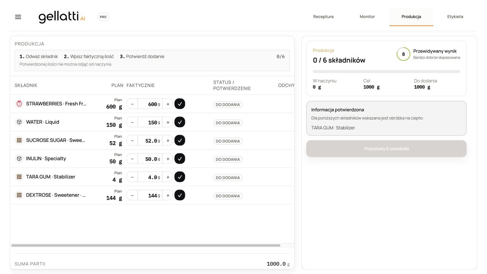
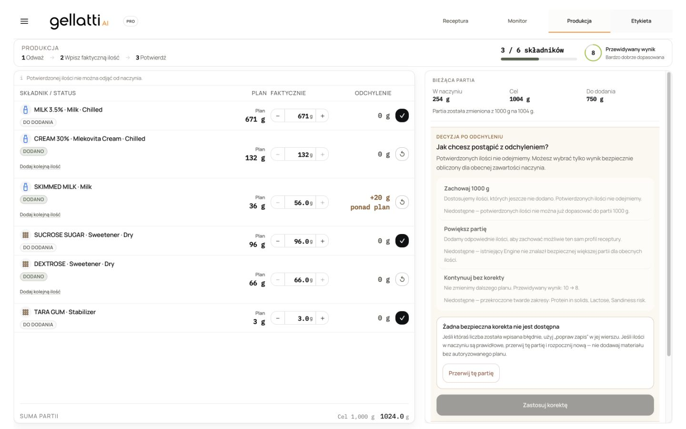
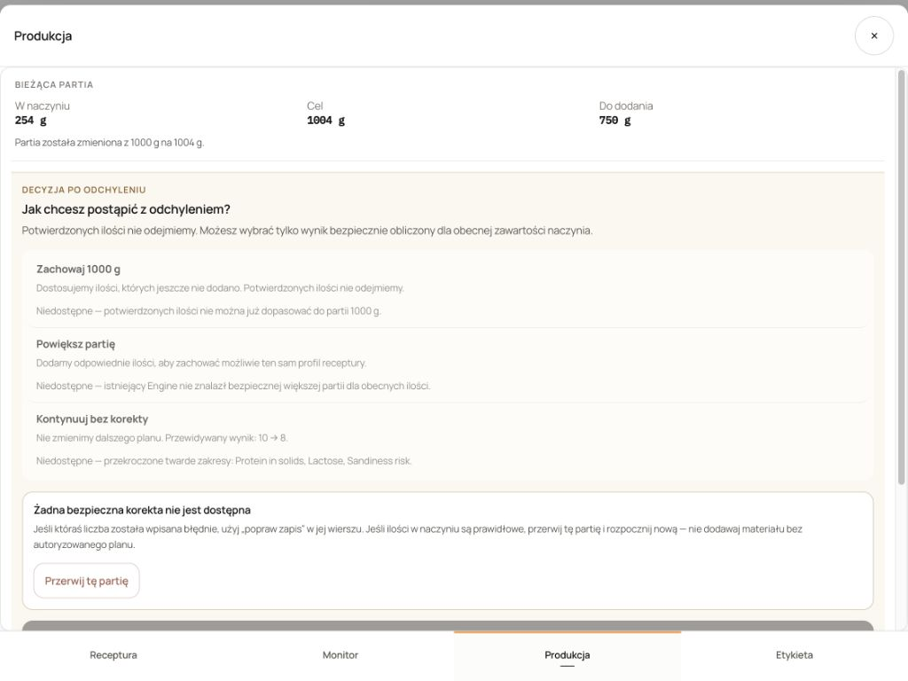
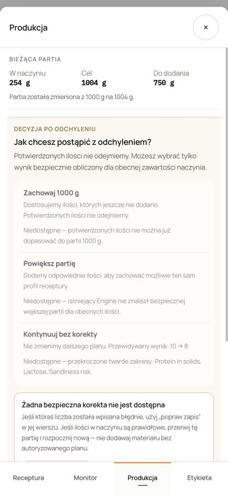
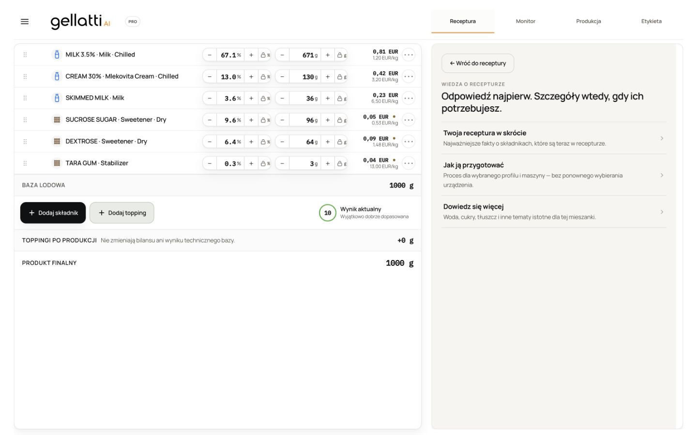
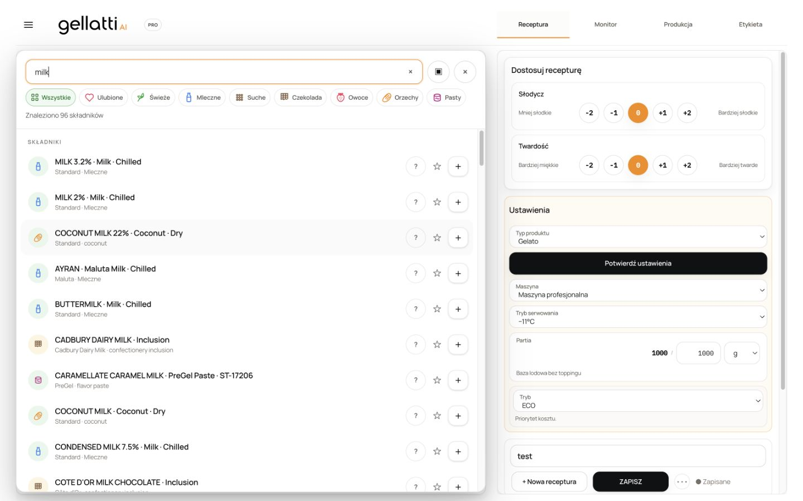

# PRO UX CONSOLIDATION — audit and repair

Date: 2026-08-25  
Application commit verified: `33f141eba86b0024e94c19a109c65b46ef0bbfa8`  
Application deployment: `dpl_2icE5znV8wAV8QPZ1QhJB63wjQEj`  
Staging URL: `https://staging.pinguinoai.com`  
Vercel build: `bld_1adqlfnec`  
Served assets: `assets/index-BW_-rQs4.js`, `assets/index-8yKgy1Hu.css`

This report records the application commit that was deployed and browser-tested. The later evidence-only commit that adds this report and the final screenshots does not change runtime source; its SHA and Vercel deployment are recorded in the final task handoff.

## 1. Requested scope

- Consolidate Pro settings without replacing the open recipe.
- Audit every visible product-profile transition, including Gelato ↔ Protein.
- Repair global catalog search pagination and long-scroll stability.
- Normalize notices, actions, score density, and the right-side Pro workspace.
- Replace the education wizard with three recipe-derived Knowledge views.
- Replace unsafe legacy/internal reference errors with customer-safe recovery UI.
- Consolidate Production into one workspace authority and remove duplicated header/progress/score/completion UI.
- Preserve accepted production behavior, including the staging sequential-deviation repair.
- Run focused and full regression gates, deploy staging only, and verify the served browser at 1440, 1024, and 390 CSS px.

## 2. Settings state → profile

### Before

The settings line reused new-recipe starter routing. A profile, serving, or machine change could enter starter-rebuild/confirmation code intended for creating a different recipe. That made the open composition, locks, toppings, and current context vulnerable to replacement.

### After

- Product type, machine, serving mode, batch, and strategy now patch the current recipe state in place.
- Ingredient rows, exact grams, toppings, ingredient locks, and recipe identity are retained.
- Confirmation produces exactly one compact status: `✓ Ustawienia potwierdzone`.
- The Engine re-evaluates the retained composition for the selected profile. The UI does not claim compatibility merely because the selection was accepted.
- No starter recipe is generated and no science calibration changes were made.

### Profile transition matrix

The four customer-visible Pro product profiles are Gelato, Proteinowe, Sorbet, and Wegańskie. All 16 transitions are supported as in-place state transitions:

| From ↓ / To → | Gelato          | Proteinowe      | Sorbet          | Wegańskie       |
| ------------- | --------------- | --------------- | --------------- | --------------- |
| Gelato        | Supported no-op | Supported       | Supported       | Supported       |
| Proteinowe    | Supported       | Supported no-op | Supported       | Supported       |
| Sorbet        | Supported       | Supported       | Supported no-op | Supported       |
| Wegańskie     | Supported       | Supported       | Supported       | Supported no-op |

“Supported” means the selected profile becomes the active evaluation authority while the current composition vector remains unchanged. It does not mean every retained composition is automatically technically valid for the destination profile.

### Gelato ↔ Protein decision

Both directions are supported. Gelato and Protein already have native Engine authorities and approved formulation paths, so the UI may switch the evaluation profile without inventing science or replacing ingredients. After the switch, the retained recipe is recalculated; any incompatibility is surfaced through existing Engine/PI results and correction paths. There is no implicit addition of protein ingredients and no silent starter reset.

Evidence: `src/features/pro-workbench/profileCompatibility.ts`, `profileCompatibility.test.ts`, and `WorkbenchSettingsLine.runtime.test.tsx` cover the complete 4 × 4 matrix and preservation contract.

## 3. Global catalog search

### Root cause

Pagination was encoded as a changing single-query limit. Increasing the limit changed the query key and temporarily replaced the settled result set, so already-visible rows could clear or jump while the larger request was in flight.

### Repair

- Replaced the changing-limit query with a stable `useInfiniteQuery`.
- Pages append to the existing result set and are deduplicated by canonical catalog identity.
- `isSettled` remains true while a next page is fetched; it changes only for a genuinely new debounced query.
- `loadMore` is idempotent while a page is already loading.
- Filters wrap compactly; scanner and close are icon controls; the redundant footer is removed.
- Empty/error states expose only truthful actions.

Served-browser proof: an unfiltered catalog retained its first result while increasing from 498 to 995 visible options after `End`; query `milk` returned 96 results. Scanner and close controls were present and no footer was rendered.

## 4. Shared Pro presentation primitives

- Added `WorkflowNotice` and migrated historical/version, product-behavior, and workbench notices to one compact visual language.
- Consolidated button/icon styles in `buttonStyles.ts`.
- Reduced right-panel density and made score readouts compact and consistent.
- Kept the existing workbench architecture and accepted actions; no broad layout rewrite was introduced.

## 5. Knowledge

### Before

The previous education surface behaved like a wizard/quiz, repeated machine choice, and contained generic Mango/Pistacja examples that were not guaranteed to belong to the open recipe.

### After

Exactly three entry points are rendered:

1. `Twoja receptura w skrócie`
2. `Jak ją przygotować`
3. `Dowiedz się więcej`

All facts are derived from the open recipe. Every current ingredient can be shown, and no invented Mango/Pistacja examples remain. The process view reuses the active machine and has no second machine selector or confirmation button. Exact heat time/temperature is omitted unless a verified source exists; otherwise the UI says so explicitly.

Served-browser proof: three entries; current Milk and Sucrose present; Mango and Pistacja absent; `Maszyna profesjonalna` reused; zero process machine selects; zero process confirmation buttons; truthful fallback text present.

## 6. Legacy recipe references

Raw UUIDs, RPC names, internal product codes, and backend implementation detail are no longer exposed in customer-facing notices. `LegacyRecipeReferenceNotice` gives a safe explanation and only a supported inspection/recovery action. ProductBehavior failures use the same customer-safe boundary.

## 7. Production workspace

### Before

Production had two visible authorities: a local instruction/progress area and a nested cockpit card with its own progress, score, and completion hierarchy. Ingredient-row production controls also competed with the cockpit hierarchy.

### After

- `ProductionWorkspaceHeader` is the single source of the instruction sequence, progress, and predicted score.
- `ProductionCockpit` no longer duplicates that header.
- Desktop uses a direct two-column workspace; tablet/mobile presents the cockpit as the existing responsive sheet.
- The production row grid is `ingredient/status | plan | actual | deviation | final action`.
- Actual grams remain a direct number control; physical confirmation is in the final action slot.
- Settled rows are quiet and noninteractive, with a plain check and no reopen/top-up affordance.
- Completion uses the production snapshot for actual mass, technical fit, LOT, and final cost.
- Primary completion action is Label; New batch is a ghost action.
- Community publication is optional, only for a saved recipe/version, reuses the existing creator profile/dialog, and can be dismissed once per recipe/version.
- Legacy production snapshots remain readable.
- The newly arrived staging sequential-deviation repair was rebased and retained. Its cancel dialog, authorization logic, and regression suites remain intact.

Served-browser proof on an existing 3/6 staging run: one `production-workspace-header`, one progress label, no local `Partia gotowa`, no horizontal overflow at any tested breakpoint, and the staging sequential-deviation decision surface remained operational and truthful.

## 8. Browser evidence

### Before



### After











Responsive measurements:

| CSS viewport | Horizontal overflow | Production headers | Progress labels |
| ------------ | ------------------: | -----------------: | --------------: |
| 1440 × 900   |                  No |                  1 |               1 |
| 1024 × 768   |                  No |                  1 |               1 |
| 390 × 844    |                  No |                  1 |               1 |

Browser console: 0 errors after Production, Knowledge, and catalog flows.

## 9. Tests added or changed

New focused coverage:

- `src/features/pro-workbench/profileCompatibility.test.ts`
- `src/features/ingredient-builder/LegacyRecipeReferenceNotice.test.tsx`

Expanded regression coverage:

- `WorkbenchSettingsLine.runtime.test.tsx`
- `contextualEducationView.test.tsx`
- `liveSearchContract.test.ts`
- `ProductPickerPopover.catalogPresentation.test.tsx`
- `productionWorkspaceUi.test.tsx`
- shared component, density, composition, mapper presentation, product behavior, and final Pro design tests.

The rebased staging commit also added/expanded sequential-deviation tests; all were rerun after conflict resolution.

## 10. Exact verification commands and results

```text
npm test -- --run src/features/constraint-studio/mainConstrainedNearestAndRescue.test.ts src/features/constraint-studio/mainTechnicalMaximum.test.ts --reporter=dot
```

Result: 2 files passed; 65 tests passed. This isolated the three earlier timeout-only cases and proved they had no assertion failure.

```text
npm test -- --run src/features/production-workspace/productionWorkspaceUi.test.tsx src/features/production-workspace/ProductionCockpit.runtime.test.tsx src/features/production-workspace/productionSequentialDeviation.test.ts src/features/production-workspace/productionRescueEdgeAuthorization.test.ts src/features/production-workspace/productionSession.test.ts src/features/production-workspace/useProductionWorkspace.test.ts src/features/ingredient-builder/rowDensity.test.ts src/features/ingredient-builder/ProductPickerPopover.catalogPresentation.test.tsx --reporter=dot --testTimeout=300000
```

Result: 8 files passed; 135 tests passed.

```text
npm test -- --run --reporter=dot --testTimeout=300000
```

Final post-rebase result: 733 files passed, 2 skipped; 9029 tests passed, 101 skipped; 0 failures. Duration 452.02 s.

```text
npm run typecheck
npm run lint
npm run build
```

Results: typecheck passed; lint passed with 0 errors and 4 pre-existing Fast Refresh warnings in unchanged files; production build passed (1277 modules transformed). Vite reported the existing large-chunk warning.

```text
git diff --name-only -z origin/staging...HEAD | while IFS= read -r -d '' task_file; do case "$task_file" in *.ts|*.tsx|*.js|*.jsx|*.json|*.md|*.css) printf '%s\0' "$task_file" ;; esac; done | xargs -0 npx prettier --check
git diff --check origin/staging...HEAD
```

Results: all changed text files passed Prettier; diff check passed.

The repository-wide `npm run format:check` was also executed and reported 1133 pre-existing unrelated files. That baseline was not hidden or bulk-rewritten. Every file changed by this task passes the scoped check above.

## 11. Previously accepted flows retested

- All six canonical customer-visible machine/serving choices remain unchanged; `Ninja 2` was not introduced.
- Demo/Home/Pro gram visibility and save-limit suites remained green in the full suite.
- Existing ingredient editing, locks, toppings, costs, Monitor, label prerequisite, save/version, and production persistence tests remained green.
- Sequential production deviation, rescue authorization, cancellation, and session restoration remained green after rebase.
- `mapper_basement` was not modified.
- No file under `src/engine` or a solver dataset was changed by this task.

## 12. Deployment verification

- Git branch deployed: `staging`.
- Git application SHA: `33f141eba86b0024e94c19a109c65b46ef0bbfa8`.
- Vercel logs explicitly show: `Branch: staging, Commit: 33f141e`.
- Deployment `dpl_2icE5znV8wAV8QPZ1QhJB63wjQEj` reached `READY` and owns alias `staging.pinguinoai.com`.
- Alias returned HTTP 200 from Vercel with `cache-control: public, max-age=0, must-revalidate`.
- Served HTML referenced the recorded JS/CSS asset hashes.
- Browser QA was performed against the alias, not localhost or a preview-only URL.
- Remote `main` remained `4dfb097d14fe91c2cc7bd67e02265e6ac41123a2` throughout the application deployment.

## 13. Remaining incomplete items and blockers

- No requested implementation item remains incomplete.
- No external action is required for the requested staging release.
- Four pre-existing lint warnings and the repository-wide formatting baseline remain outside this task's scope and are recorded above.
- Production deployment was neither requested nor performed.

## 14. Git status at application deployment

- Application commit: `33f141eba86b0024e94c19a109c65b46ef0bbfa8`.
- Commit message: `feat(pro): consolidate professional UX workflows`.
- Application diff: 47 files changed, 2051 insertions, 1350 deletions.
- Runtime source was clean after commit; only the local untracked `node_modules` worktree symlink was excluded.
- The evidence-only report/screenshots commit is intentionally separate and is identified in the final task handoff.

**ENGINE/SOLVER SCIENCE WAS NOT RECALIBRATED.**

**STAGING DEPLOYED AND SERVED-BROWSER VERIFIED.**

**PRODUCTION WAS NOT DEPLOYED.**
