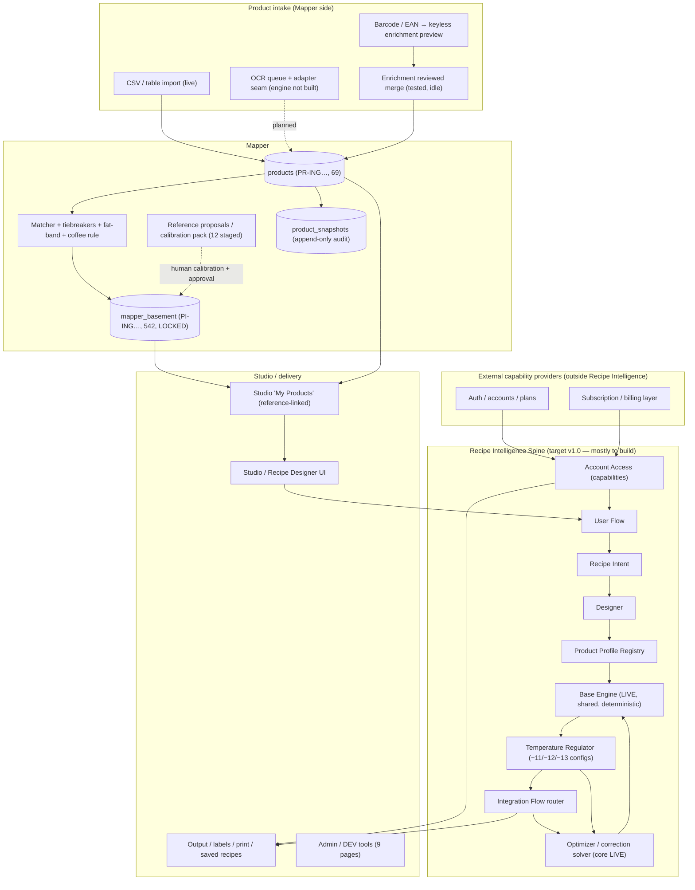
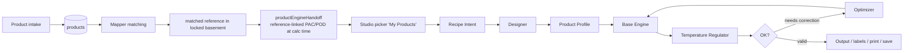
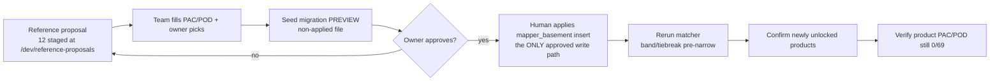
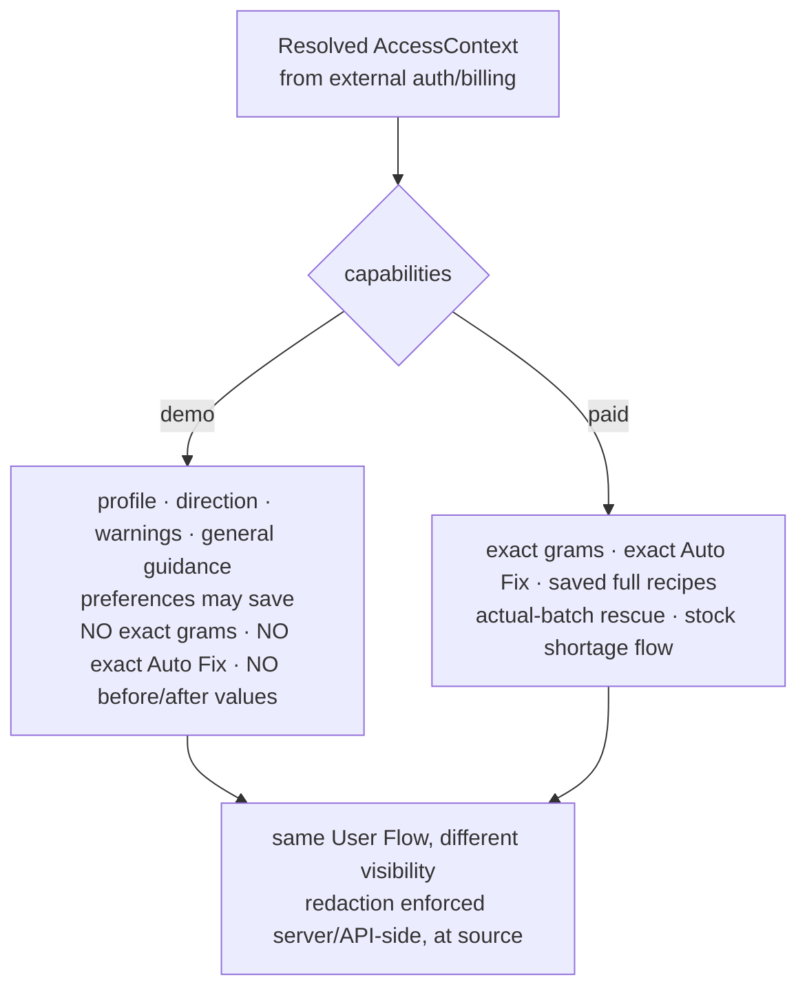
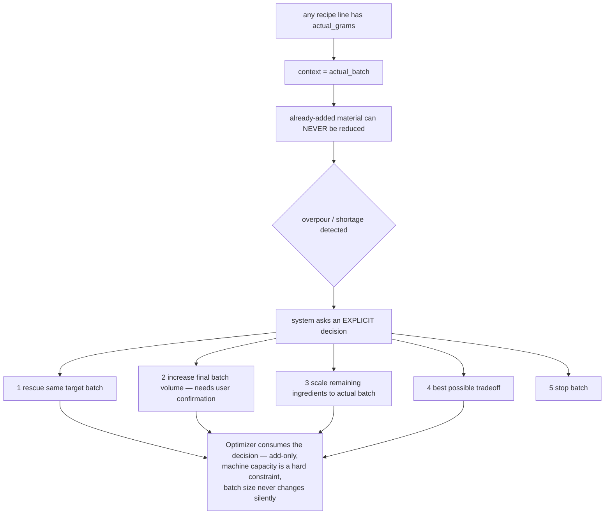
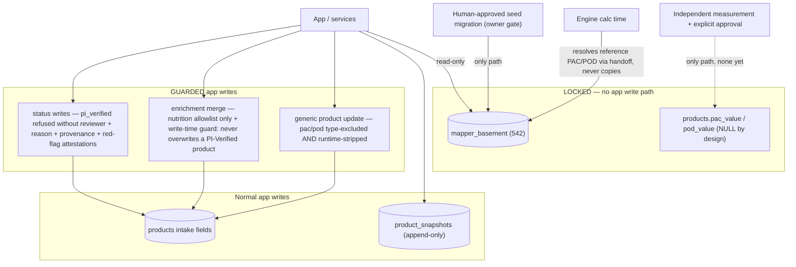

# PINGUINO SPINE — Repo-Level Architecture Map

_Created 2026-07-05 at repo HEAD `9bffb0c`. This is the repo-level companion to the **locked Spine
documents** in [`docs/pinguino-spine/`](pinguino-spine/) — it maps what the Spine specifies against
what this repository actually contains. The locked documents are the source of truth for the target
architecture; this file is the evidence-based status map. The owner's planning document remains
[PINGUINO_MASTERPLAN_V1.md](PINGUINO_MASTERPLAN_V1.md) — this file does not replace it._

Neutral-wording rule (from the locked docs): never name external benchmark tools/products in code,
prompts, UI or docs — say **external benchmark data**, **calibration data** or **reference dataset**.

---

## 1. Executive summary

**PINGUINO Intelligence** is a deterministic gelato/sorbet recipe-intelligence system: a pure
calculation engine (the **Base Engine**) surrounded by a product-strategy spine, fed by a verified
ingredient layer (**Mapper**), and delivered through a Studio UI with demo/paid capability gating.

**The Spine** is the locked v1.0 architecture: one shared Base Engine; **Product Profiles**
(standard_gelato · sorbet · vegan_gelato · chocolate_gelato) decide which gates apply; **Recipe
Intent** normalizes user choices; **Designer** turns intent into strategy + constraints; **User
Flow** defines how the customer is asked (flavor-first, never price/technical); **Account Access**
resolves demo/paid capabilities; the **Temperature Regulator** evaluates product + serving
temperature (−11/−12/−13 °C); the **Optimizer** adjusts grams only through deterministic verified
correction; **Integration Flow** fixes the execution order; **Acceptance Tests** enforce it all.
**AI explains and routes; AI never calculates exact recipe values.**

Where the repo stands today, in one line each:

- **LIVE:** Base Engine core (−11 °C calibrated, ENGINE 0.4.0 / CONFIG 0.5.0), correction solver
  with demo redaction at source, Mapper Basement (542 locked refs), Product Mapper (69 products,
  23 matched — paused for human calibration), Studio "My Products" (reference-linked handoff),
  reference-proposal staging + team calibration pack, snapshots/audit, 10 DEV tools.
- **PARTIAL:** access gating (demo/Pro exists; the `AccessContext`/capabilities contract does not),
  intake (classifier + OCR queue + honest `not_implemented` OCR seam; no OCR engine), enrichment
  (reviewed-merge path tested, currently no enrichable product), conversational intake precursors.
- **NOT STARTED (the Spine's Recipe-Intelligence layer):** Product Profile Registry, Recipe Intent
  normalization, Designer, Temperature Regulator configs (−12/−13 bands), Integration Flow router,
  batch-size/actual-batch-rescue user flow, stock-shortage flow, User Flow conversational script.
- **BLOCKED (on humans, correctly):** Mapper calibration (PAC/POD for 12 staged reference
  proposals + 4 owner picks — see
  [mapper/OWNER_TEAM_CALIBRATION_HANDOFF.md](mapper/OWNER_TEAM_CALIBRATION_HANDOFF.md)).

---

## 2. Active Spine documents (locked, in `docs/pinguino-spine/`)

Read in this order:

| # | Document | Role |
|---|---|---|
| 1 | [Calculation Source of Truth](pinguino-spine/Calculation_Source_of_Truth.md) | Master calculation contract (CONTRACT_VERSION 1.0.0) |
| 2 | [Core Backbone](pinguino-spine/Core_Backbone.md) | Architecture spine + module ownership (supersedes the old v0.1 backbone — which is **not** present in this repo; nothing to archive) |
| 3 | [Product Profile](pinguino-spine/Product_Profile.md) | Profile registry: gates, routing, correction families |
| 4 | [Recipe Intent](pinguino-spine/Recipe_Intent.md) | `NormalizedRecipeIntent` contract v1.0.0 |
| 5 | [Designer](pinguino-spine/Designer.md) | Strategy layer → `RecipeDesignPlan` + optimizer constraints |
| 6 | [User Flow](pinguino-spine/User_Flow.md) | Customer conversation ("Jakie lody dziś robimy?" first) |
| 7 | [Account Access](pinguino-spine/Account_Access.md) | `AccessContext` + capabilities; demo redaction rules |
| 8 | [Temperature Regulator GELATO](pinguino-spine/Temperature_Regulator_GELATO.md) | Standard Gelato bands −11/−12/−13 |
| 9 | [Temperature Regulator SORBET](pinguino-spine/Temperature_Regulator_SORBET.md) | Sorbet bands −11/−12/−13 |
| 10 | [Temperature Regulator VEGAN](pinguino-spine/Temperature_Regulator_VEGAN.md) | Vegan bands −11/−12/−13 |
| 11 | [Temperature Regulator CHOCOLATE](pinguino-spine/Temperature_Regulator_CHOCOLATE.md) | Chocolate bands −11/−12/−13 |
| 12 | [Optimizer](pinguino-spine/Optimizer.md) | Deterministic correction + batch/rescue/shortage policy |
| 13 | [Integration Flow](pinguino-spine/Integration_Flow.md) | End-to-end execution order |
| 14 | [Acceptance Tests](pinguino-spine/Acceptance_Tests.md) | Pass/fail matrix (release gate) |

**Active product profiles v1.0:** `standard_gelato`, `sorbet`, `vegan_gelato`, `chocolate_gelato`.
**Unsupported unless docs are explicitly updated:** granita, protein_gelato, fresh, storage −18 °C,
frozen drinks/slush. Protein may be *recognized as intent* in User Flow but is never silently
calculated as a supported profile.

---

## 3. System map



Future modules referenced by planning docs but **not** in the active Spine set: franchise/SOP layer
and the PU/Umami extension (see [PINGUINO_COMMERCIAL_ECOSYSTEM_V1.md](PINGUINO_COMMERCIAL_ECOSYSTEM_V1.md)) —
listed here for completeness only; no Spine document activates them.

---

## 4. Data flow maps

### 4.1 Recipe flow — Mapper → Studio → engine chain (target v1.0)



### 4.2 Reference calibration flow (the current human gate)



### 4.3 Demo / Paid boundary (Account Access)



### 4.4 Actual-batch rescue (locked decision flow)



---

## 5. Safety rules (non-negotiable, enforced today)

### 5.1 Safety boundaries (write-path map)



### 5.2 Safety rules

```text
mapper_basement is locked — never auto-written; inserts only via approved human seed migration
products is the growing intake table
PR-ING codes belong to products; PI-ING codes belong to the basement
product PAC/POD stays NULL unless independently measured AND explicitly approved
  (structurally enforced: the generic product-update path type-excludes + runtime-strips pac/pod)
reference-linked PAC/POD is resolved at calculation time (productEngineHandoff), never copied
no ingredient-level npac_value as active truth (engine ignores it even if present; regression-tested)
PI Verified requires independent provenance + red-flag clearance
  (service-level guard refuses pi_verified without reviewer + reason + both attestations)
OCR must not fake extracted text (the adapter returns not_implemented with a null extraction)
AI must not invent exact grams, POD/PAC/NPAC, costs or ingredient data
Demo must not reveal exact grams / exact Auto Fix / exact before-after values (redaction at source)
Optimizer must not silently change batch size; already-added material is never reduced
```

---

## 6. Current status table (evidence-based, 2026-07-05)

| Module | Status | Next action |
|---|---|---|
| Mapper Basement | **Done** (542 locked refs; read-only service; RLS SELECT-only) | none — inserts only via approved seed migration |
| Product Mapper | **Done, paused** (69 products: 23 matched / 3 rejected / 43 null; integrity 0 violations) | wait for human calibration; then rerun matcher |
| Matching / tiebreakers / fat-band / coffee fix | **Done** (composition matcher + name-concept tiebreak + milk fat-band + coffee special-case; false-positive tested) | extend concepts only as new intake demands |
| Reference proposals / calibration pack | **Done** (12 proposals unlocking 17 products; local PAC/POD drafts; JSON/CSV export; always-blocked insert readiness) | **HUMAN: fill PAC/POD + owner picks** |
| Studio "My Products" | **Done** (reference-linked handoff; recipe-math-equivalence proven; provenance labels; auth-free browser proof) | grows automatically as products are confirmed |
| Recipe Engine (Base Engine) | **Partial** — core **Done** for −11 °C (deterministic, ENGINE 0.4.0 / CONFIG 0.5.0, versions stamped, no-NPAC enforced, golden recipes); −12/−13 exist only as intent values, not calibrated configs | keep frozen until Spine layers exist; then add regulator configs (never duplicate engines) |
| Product Profile Registry | **Not started** (no code; engine has lower-level categories `milk_gelato`… which the Spine maps to profiles) | implement per Spine order step 2 |
| Recipe Intent | **Not started** (`RecipeGoals` is a precursor; explicit mapping table exists in the Spine) | implement `normalizeRecipeIntent` (pure) per Spine |
| Designer | **Not started** (demo scenarios/presets are a weak precursor) | implement after Recipe Intent (D1–D8 slices) |
| User Flow | **Not started** as spec'd (pi-chat intake flows exist as a precursor; the locked Polish-first script is not implemented) | wire after Designer; flavor-first, never price-first |
| Account Access | **Partial** (demo/Pro access hook; **solver redacts at source** since engine 0.4.0; no `AccessContext`/capabilities contract) | implement the capabilities contract; keep login/billing external |
| Temperature Regulator | **Not started** (only the −11 °C anchor domain is seeded in config; all product/temp bands are locked in the four regulator docs) | config registry per product × temperature; bump CONFIG_VERSION |
| Optimizer | **Partial** (deterministic solver: violations → Golden Middle priority → exact-gram candidates → full recalc verification → tradeoff/impossible; planning/actual-batch contexts; redaction) | make profile-aware; add batch-volume decision + stock-shortage consumption per Spine |
| Integration Flow router | **Not started** | implement after profiles/intent/designer/regulator |
| OCR / barcode / intake | **Partial** (pure classifier; multi-file picker; label-image queue; `parseNutritionLabelImage` = `not_implemented`, no fake text; EAN→enrichment prefill) | first keyless/LOCAL OCR engine behind the existing seam |
| Enrichment (external public data) | **Done, idle** (compare fill/agree/conflict/skip; nutrition-allowlist write + snapshot; PI-Verified write-time guard; keyless lookup) | becomes useful with first non-catalog product |
| Snapshots / audit trail | **Done** (append-only `product_snapshots`, 69 rows; diff service; `/dev/snapshot-audit`) | — |
| Admin / DEV tools | **Done** (10 DEV-gated pages incl. mapper review/status, reference proposals, intake hub, enrichment, snapshot audit, picker proof, and `/dev/spine` — the static status board for this map) | — |
| Auth / plans / subscriptions | **Partial, external by design** (auth + billing feature layers with security guards; Free Preview mode; no service_role in frontend) | connect as the external capability provider feeding AccessContext |
| Labels / print / export | **Not started** (destination page placeholder only) | Phase E work |
| Franchise / SOP / docs | **Not started** (commercial ecosystem doc only) | future phase |
| Future PU / Umami extension | **Not in active Spine docs** (mentioned only in commercial planning) | requires explicit future documents |

Mapper DB state at time of writing: 69 products · 23 matched · 3 rejected · 43 null ·
Studio-eligible 23 · basement 542 · product PAC/POD 0/69 · PI Verified 0 · snapshots 69.

---

## 7. Module-by-module repo audit (what exists / key files / what's missing / risk)

### Base Engine
- **Exists:** pure deterministic core — `src/engine/` (composition, `pod.ts`, `pac.ts`, ice
  fraction + anchors, statuses, nutrition, cost, scoring, `calculateRecipe.ts`, `corrections/`
  solver, `config/` incl. `version.ts` = 0.4.0/0.5.0); golden recipes + no-NPAC regression tests.
- **Missing vs Spine:** −12/−13 configs; profile-aware gate activation; `custom` category posture.
- **Risk: LOW** while frozen. Spine explicitly says: do not rewrite; extend via config registries.

### Correction solver (Optimizer core)
- **Exists:** `src/engine/corrections/` — candidates, exact-gram solving, apply, verification by
  full recalc, planning/actual-batch contexts, demo redaction at source, tradeoff outcomes.
- **Missing vs Spine:** profile-specific candidate families (dairy vs sorbet vs vegan vs chocolate),
  hero-ingredient tier policy, batch-volume decision consumption, stock-shortage flow.
- **Risk: MEDIUM** if extended before Product Profile/Designer exist (the Spine forbids that order).

### Mapper (paused, complete for this phase)
- **Exists:** `src/data/products/` (matcher, tiebreak, fat-band, red flags, status decision,
  engine handoff/library, enrichment, snapshots diff, identity, classifier, OCR seam,
  referenceProposals) + `src/services/` (products, ingredients read-only, review, status write
  with PI-Verified guard, enrichment with write-time guard, snapshots, keyless lookup) + 10 DEV pages.
- **Missing:** nothing Claude-solvable; human calibration gates everything else.
- **Risk: LOW** — hardened this week (service-level PI-Verified guard, structural pac/pod strip,
  TOCTOU write guard), 0 integrity violations.

### Studio / delivery
- **Exists:** Studio recipe builder on the −11 °C engine, ingredient picker with My Products +
  provenance labels, saved recipes payloads (accept legacy npac field read-only), PI panel/chat
  features, demo/Pro access hook.
- **Missing vs Spine:** the whole conversational User Flow, batch-size step, capability-shaped
  output/redaction contract, labels/print.
- **Risk: LOW-MEDIUM** — the picker/handoff seam is proven; UI rework waits for the Spine layers.

### Access / commercial boundary
- **Exists:** `features/auth` + `features/billing` with security tests (no service_role, no
  provider names in engine); Free Preview; Pro gating of the library.
- **Missing vs Spine:** `AccessContext`/`AccessCapabilities` contract; upgrade-reason codes;
  server-side capability enforcement wrapper.
- **Risk: MEDIUM** for production (documented Rule 1: client-side hiding is not enough) — the
  solver-level redaction is the right foundation.

### Unknowns (explicitly not guessed)
- Whether any external API layer exists beyond the SPA (none found in repo — treated as future).
- PU/Umami scope — no active Spine document; only commercial-plan mentions.

---

## 8. Docs consistency findings (Phase 5 audit)

1. **"−11°C Engine" wording** (Studio UI copy, engine README, masterplan) vs the Spine's
   "shared Base Engine + Temperature Regulator" — **expected, documented drift**: the Spine itself
   (§21 migration notes) orders the supersession during implementation. No action now; do NOT
   create separate −12/−13 engines.
2. **`RecipeGoals` vocabulary** (`sweetness: normal`…) vs Spine (`balanced`…) — the Spine provides
   the explicit mapping table (Recipe Intent §21); implementation must map, not rename blindly.
3. **Engine categories vs ProductProfile** — mapping table locked in Product Profile §5; repo
   unchanged, no contradiction.
4. **Old Core Backbone v0.1** — not present in this repo; nothing to archive. The superseding rule
   is recorded here so it is never re-imported as truth.
5. **Mapper docs** (implementation status, queue analysis, calibration handoff, gap proposals,
   insert candidates, PACPOD handoff plan, intake/enrichment plans) — audited 2026-07-05, all
   current with live DB/code; no contradictions with the Spine (the Spine's Mapper boundary §19
   matches the implemented reality).
6. **Masterplan vs Spine** — complementary, not conflicting: the masterplan is the owner's phase
   plan; the Spine documents are the locked architecture contracts; this file is the map between
   the Spine and the repo.

---

## 9. Where to go next

The step-by-step build order lives in
[PINGUINO_NEXT_IMPLEMENTATION_ROADMAP.md](PINGUINO_NEXT_IMPLEMENTATION_ROADMAP.md).
The immediate human gate is unchanged:
[mapper/OWNER_TEAM_CALIBRATION_HANDOFF.md](mapper/OWNER_TEAM_CALIBRATION_HANDOFF.md).

```text
If a rule is missing, stop and ask. (Locked-document convention — applies to this map too.)
```
