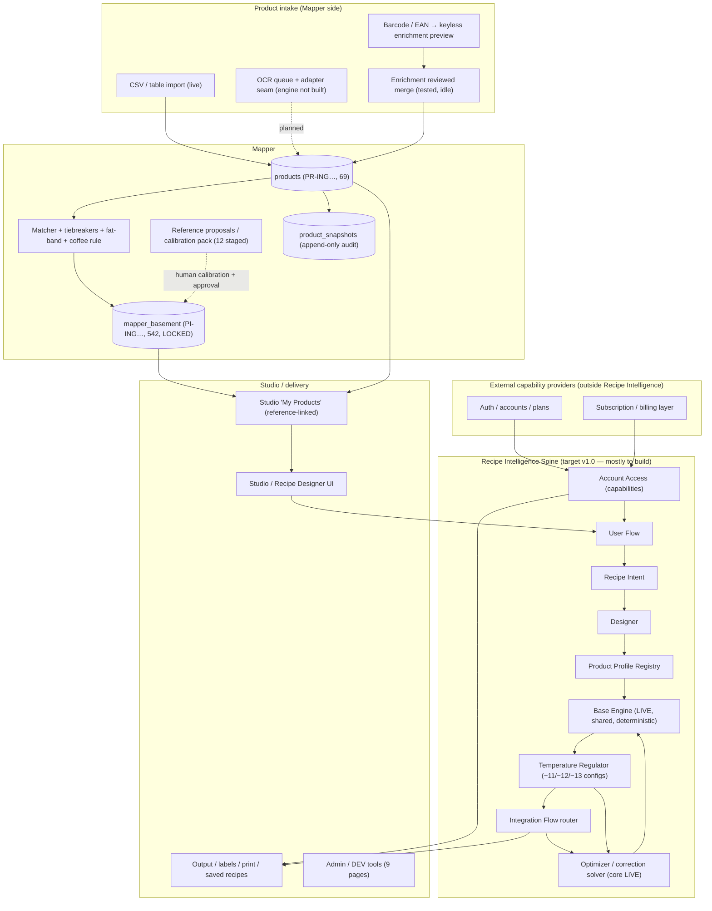
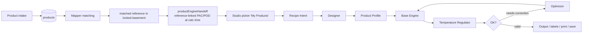
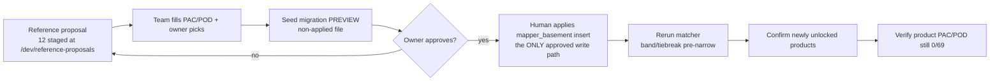
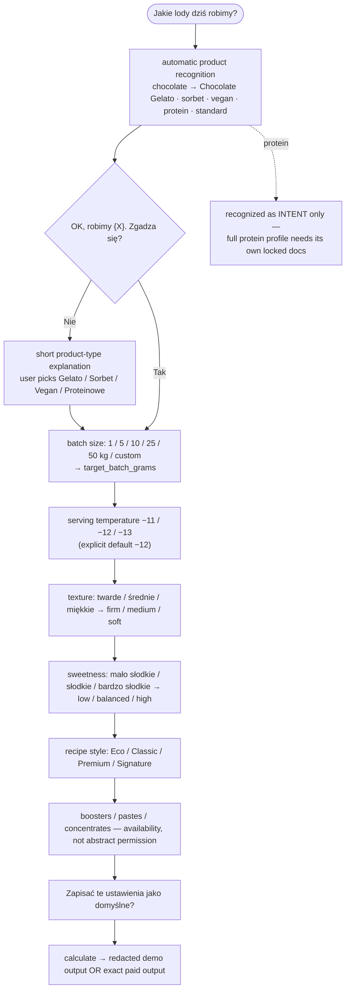
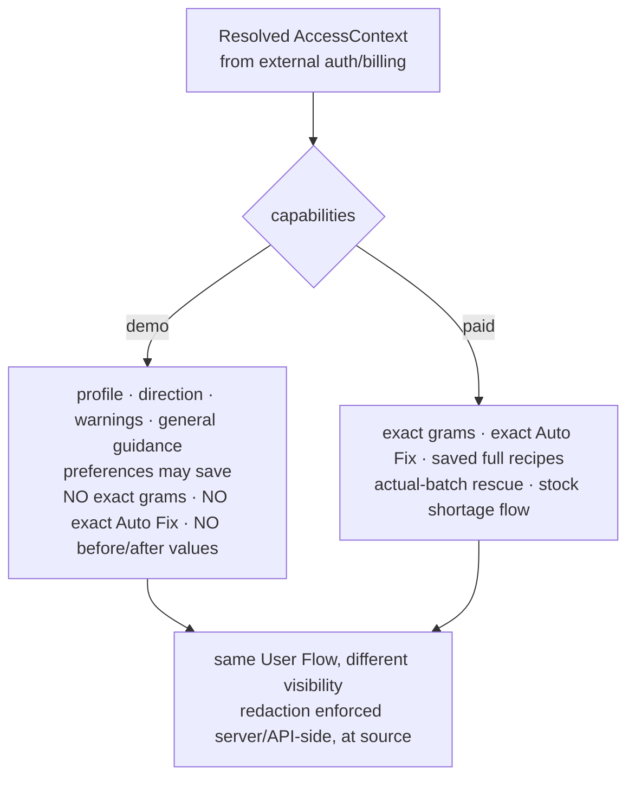
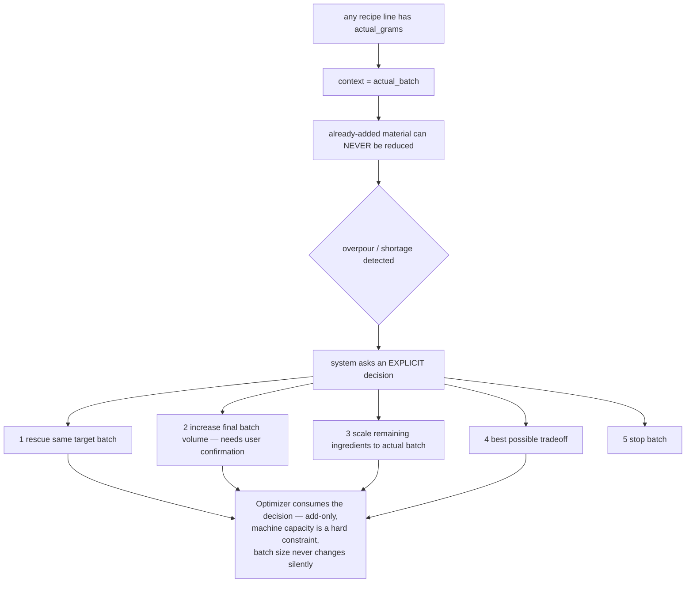
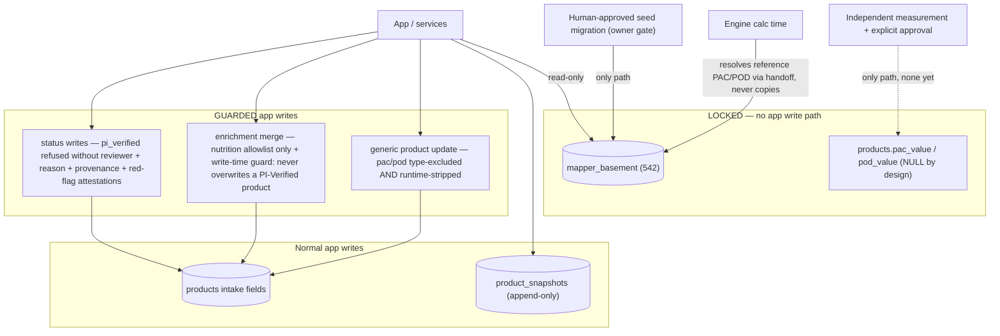

# PINGUINO SPINE — Repo-Level Architecture Map

_Created 2026-07-05 at repo HEAD `9bffb0c`; audit refreshed 2026-07-06 at HEAD `4c7dea9` (flat doc
paths, consistency fixes verified); Temperature Regulator **evaluation layer** (Phase C Slice 5),
the **Integration Flow decision router** (Phase C Slice 6) and the **Optimizer routing layer**
(Phase C Slice 7) added 2026-07-07; the **solver + Base Engine rerun preview seam** (Phase C Slice 8)
added 2026-07-08; the **DEV Optimization Preview** (Phase C Slice 9, `/dev/optimization-preview` +
`src/features/optimization/`) and the **Studio Optimization Preview panel** (Phase C Slice 10 —
`OptimizationPreviewPanel` + capability/redaction policy, DEV-gated into Studio) and the
**temperature-aware target seam** (Phase C Slice 11 — `temperatureAwareCorrectionTargets`, instrumented
divergence detection), the **shadow target-band comparison** (Phase C Slice 12 —
`temperatureAwareTargetBands` + [target-bands plan](engine/TEMPERATURE_AWARE_TARGET_BANDS_PLAN.md), NON-live)
the **solver-injected regulator targets** preview (Phase C Slice 13 — `solverTargetInjection`,
re-targets the solver's violation detection at the regulator bands in preview only; live engine unchanged)
the **solver target override for a real gram solve** (Phase C Slice 14 — additive optional
`targetBandOverride` on the engine solver; the preview runs engine-seeded vs regulator-shadow gram solves,
global `TARGET_BANDS` unchanged, default behavior byte-identical) the **production Studio optimization
preview** (Phase C Slice 15 — the preview is promoted out of the DEV-only gate into the normal Studio flow,
capability-gated, click-triggered, NO persistence; `/dev/optimization-preview` stays a separate DEV tool)
added 2026-07-08, the **accepted-correction persistence design** (Phase C Slice 16 — pure draft
contract + NON-applied migration proposal + approval checklist; no migration applied, no DB write)
the **Actual Batch Rescue branch IF9** (Phase C Slice 17 — pure `batchRescueRouter`, observed-problem
→ rescue decision, add-only, food-safety-first, gram-free; see [BATCH_RESCUE_FLOW.md](spine/BATCH_RESCUE_FLOW.md))
the **Stock Shortage branch IF10** (Phase C Slice 18 — pure `stockShortageRouter`, shortage observation
→ substitution/scale/purchase/reformulation decision with never-silent substitution safety gates and the
locked §18 user-decision menu; see [STOCK_SHORTAGE_FLOW.md](spine/STOCK_SHORTAGE_FLOW.md)) and the
**IF9/IF10 Integration Flow wiring + exact-recalculation preview** (Phase C Slice 19 —
`integrationFlowDispatch` + `branchRecalculationPreview` + `/dev/branch-recalculation-preview`;
verification-gated numbers only; see [BRANCH_RECALCULATION_PREVIEW.md](spine/BRANCH_RECALCULATION_PREVIEW.md))
added 2026-07-09. This is the repo-level companion to the **locked Spine
documents** in [`docs/pinguino-spine/`](pinguino-spine/) — it maps what the Spine specifies against
what this repository actually contains. The locked documents are the source of truth for the target
architecture; this file is the evidence-based status map. The owner's planning document remains
[PINGUINO_MASTERPLAN_V1.md](PINGUINO_MASTERPLAN_V1.md) — this file does not replace it._

Neutral-wording rule (from the locked docs): never name external benchmark tools/products in code,
prompts, UI or docs — say **external benchmark data**, **calibration data** or **reference dataset**.

---

## 1. Executive summary

**PINGUINO Intelligence** is a deterministic gelato/sorbet recipe-intelligence system: a pure
calculation engine (the **Base Engine**) surrounded by a product-strategy spine, fed by a verified
ingredient layer (**Mapper**), and delivered through a Studio UI with demo/paid capability gating.

**The Spine** is the locked v1.0 architecture: one shared Base Engine; **Product Profiles**
(standard_gelato · sorbet · vegan_gelato · chocolate_gelato) decide which gates apply; **Recipe
Intent** normalizes user choices; **Designer** turns intent into strategy + constraints; **User
Flow** defines how the customer is asked (flavor-first, never price/technical); **Account Access**
resolves demo/paid capabilities; the **Temperature Regulator** evaluates product + serving
temperature (−11/−12/−13 °C); the **Optimizer** adjusts grams only through deterministic verified
correction; **Integration Flow** fixes the execution order; **Acceptance Tests** enforce it all.
**AI explains and routes; AI never calculates exact recipe values.**

Where the repo stands today, in one line each:

- **LIVE:** Base Engine core (−11 °C calibrated, ENGINE 0.4.0 / CONFIG 0.5.0), correction solver
  with demo redaction at source, Mapper Basement (542 locked refs), Product Mapper (69 products,
  23 matched — paused for human calibration), Studio "My Products" (reference-linked handoff),
  reference-proposal staging + team calibration pack, snapshots/audit, 10 DEV tools, and the
  Spine's pure foundation layer (`src/spine/`: locked contracts + Product Profile Registry +
  profile normalization — Phase C Slice 1, not yet wired into the app flow).
- **PARTIAL:** access gating (demo/Pro exists; the `AccessContext`/capabilities contract does not),
  intake (classifier + OCR queue + honest `not_implemented` OCR seam; no OCR engine), enrichment
  (reviewed-merge path tested, currently no enrichable product), conversational intake precursors.
- **NOT STARTED (the Spine's Recipe-Intelligence behavior):** the LIVE accepted-correction write path
  (Slice 16 DESIGNED it — pure draft contract + non-applied migration proposal + approval checklist —
  but no migration is applied and nothing writes), the IF9/IF10 production USER flows (Slices 17–19
  built the pure DECISION branches, the Integration Flow dispatch and the verification-gated
  exact-recalculation PREVIEW — `/dev` only; production branch UI + multi-step rescue solving remain),
  User Flow conversational script. (PRODUCTION (non-DEV) Studio SURFACING of the optimization preview is
  DONE in Slice 15 — capability-gated, click-triggered, NO persistence. Recipe Intent normalization, the Designer's `RecipeDesignPlan`, the
  Temperature Regulator *config registry* + *evaluation layer*, the *Integration Flow decision router*,
  the *Optimizer routing layer* and the *solver + Base Engine rerun preview seam* landed as pure code in
  Slices 2–8; a **DEV preview** at `/dev/optimization-preview` (Slice 9), a reusable
  **OptimizationPreviewPanel** + capability/redaction policy wired **DEV-gated** into the LIVE Studio
  recipe (Slice 10), and a **temperature-aware target seam** (Slice 11) that instruments the divergence
  between the solver's −11 seeded target and the regulator target followed — real solver + `calculateRecipe`,
  nothing saved. The solver is NOT yet truly temperature-aware (it still aims at the −11 seeded band; the
  seam reports `temperature_target_not_connected` at −12/−13); a non-live **shadow target-band
comparison** (Slice 12) audits the engine-vs-regulator band gap, a **solver-injected regulator target**
preview (Slice 13) re-targets the solver's violation detection at the regulator bands, and a **solver
target override** (Slice 14) lets the REAL gram solve aim at the injected regulator bands in preview —
all WITHOUT altering live engine config or `calculateRecipe`; the solver gains only an additive optional
override whose default is byte-identical. The preview now shows engine-seeded vs regulator-shadow gram
solves side by side, and Slice 15 SURFACES it in production Studio — capability-gated, click-triggered,
disclaimer-labelled, NOTHING saved/applied/persisted; the DEV trace + `/dev/optimization-preview` stay
dev-only. Slice 16 designed the accepted-correction persistence (draft contract + non-applied migration
proposal + approval checklist); the LIVE write path awaits owner approval.)
- **BLOCKED (on humans, correctly):** Mapper calibration (PAC/POD for 12 staged reference
  proposals + 4 owner picks — see
  [mapper/OWNER_TEAM_CALIBRATION_HANDOFF.md](mapper/OWNER_TEAM_CALIBRATION_HANDOFF.md)).

---

## 2. Active Spine documents (locked, in `docs/pinguino-spine/`)

Read in this order:

| # | Document | Role |
|---|---|---|
| 1 | [Calculation Source of Truth](pinguino-spine/Calculation_Source_of_Truth.md) | Master calculation contract (CONTRACT_VERSION 1.0.0) |
| 2 | [Core Backbone](pinguino-spine/Core_Backbone.md) | Architecture spine + module ownership (supersedes the old v0.1 backbone — which is **not** present in this repo; nothing to archive) |
| 3 | [Product Profile](pinguino-spine/Product_Profile.md) | Profile registry: gates, routing, correction families |
| 4 | [Recipe Intent](pinguino-spine/Recipe_Intent.md) | `NormalizedRecipeIntent` contract v1.0.0 |
| 5 | [Designer](pinguino-spine/Designer.md) | Strategy layer → `RecipeDesignPlan` + optimizer constraints |
| 6 | [User Flow](pinguino-spine/User_Flow.md) | Customer conversation ("Jakie lody dziś robimy?" first) |
| 7 | [Account Access](pinguino-spine/Account_Access.md) | `AccessContext` + capabilities; demo redaction rules |
| 8 | [Temperature Regulator GELATO](pinguino-spine/Temperature_Regulator_GELATO.md) | Standard Gelato bands −11/−12/−13 |
| 9 | [Temperature Regulator SORBET](pinguino-spine/Temperature_Regulator_SORBET.md) | Sorbet bands −11/−12/−13 |
| 10 | [Temperature Regulator VEGAN](pinguino-spine/Temperature_Regulator_VEGAN.md) | Vegan bands −11/−12/−13 |
| 11 | [Temperature Regulator CHOCOLATE](pinguino-spine/Temperature_Regulator_CHOCOLATE.md) | Chocolate bands −11/−12/−13 |
| 12 | [Optimizer](pinguino-spine/Optimizer.md) | Deterministic correction + batch/rescue/shortage policy |
| 13 | [Integration Flow](pinguino-spine/Integration_Flow.md) | End-to-end execution order |
| 14 | [Acceptance Tests](pinguino-spine/Acceptance_Tests.md) | Pass/fail matrix (release gate) |

**Active product profiles v1.0:** `standard_gelato`, `sorbet`, `vegan_gelato`, `chocolate_gelato`.
**Unsupported unless docs are explicitly updated:** granita, protein_gelato, fresh, storage −18 °C,
frozen drinks/slush. Protein may be *recognized as intent* in User Flow but is never silently
calculated as a supported profile.

---

## 3. System map



Future modules referenced by planning docs but **not** in the active Spine set: franchise/SOP layer
and the PU/Umami extension (see [PINGUINO_COMMERCIAL_ECOSYSTEM_V1.md](PINGUINO_COMMERCIAL_ECOSYSTEM_V1.md)) —
listed here for completeness only; no Spine document activates them.

---

## 4. Data flow maps

### 4.1 Recipe flow — Mapper → Studio → engine chain (target v1.0)



### 4.2 Reference calibration flow (the current human gate)



### 4.3 User conversation flow (locked Polish-first script)



Never price-first, never technical-metric-first. Protein is never silently calculated as a
supported profile. Returning users with saved defaults skip straight to flavor.

### 4.4 Demo / Paid boundary (Account Access)



### 4.5 Actual-batch rescue (locked decision flow)



---

## 5. Safety rules (non-negotiable, enforced today)

### 5.1 Safety boundaries (write-path map)



### 5.2 Safety rules

```text
mapper_basement is locked — never auto-written; inserts only via approved human seed migration
products is the growing intake table
PR-ING codes belong to products; PI-ING codes belong to the basement
product PAC/POD stays NULL unless independently measured AND explicitly approved
  (structurally enforced: the generic product-update path type-excludes + runtime-strips pac/pod)
reference-linked PAC/POD is resolved at calculation time (productEngineHandoff), never copied
no ingredient-level npac_value as active truth (engine ignores it even if present; regression-tested)
PI Verified requires independent provenance + red-flag clearance
  (service-level guard refuses pi_verified without reviewer + reason + both attestations)
OCR must not fake extracted text (the adapter returns not_implemented with a null extraction)
AI must not invent exact grams, POD/PAC/NPAC, costs or ingredient data
Demo must not reveal exact grams / exact Auto Fix / exact before-after values (redaction at source)
Optimizer must not silently change batch size; already-added material is never reduced
Temperature Regulator must not change recipe chemistry (interpretation only)
Designer must not calculate POD/PAC/NPAC (strategy only; the Base Engine calculates)
```

---

## 6. Current status table (evidence-based, refreshed 2026-07-06)

| Module | Status | Evidence & key files | Risk | Next action |
|---|---|---|---|---|
| Mapper Basement | **Done** | 542 locked refs, RLS SELECT-only (DB verified 2026-07-05); read-only service `src/services/ingredients.ts` | Low | none — inserts only via approved human seed migration |
| Product Mapper | **Blocked (human)** | 69 products: 23 matched / 3 rejected / 43 null, 0 integrity violations (DB verified 2026-07-05); `src/data/products/`, `/dev/mapper-review`, `/dev/mapper-status` | Low | wait for calibration; then rerun matcher over the 43 |
| Matching / tiebreakers / fat-band / coffee fix | **Done** | composition matcher + name-concept tiebreak + milk fat-band + coffee special-case, false-positive-tested in the green suite; `productMatcher.ts`, `productNameTiebreak.ts`, `productMilkFatBand.ts` | Low | extend concepts only as new intake demands |
| Reference proposals / calibration pack | **Blocked (human)** | 12 proposals unlocking ~17 products, JSON/CSV pack export, always-blocked insert readiness; `referenceProposals.ts`, `/dev/reference-proposals`, [handoff doc](mapper/OWNER_TEAM_CALIBRATION_HANDOFF.md) | Low | **HUMAN: fill PAC/POD + 4 owner picks** |
| Studio "My Products" | **Done** | reference-linked handoff, recipe-math-equivalence browser-proven; `productEngineHandoff.ts`, `productLibrary.ts`, `/dev/studio-picker-proof` | Low | grows automatically as products are confirmed |
| Recipe Engine (Base Engine) | **Partial** (core Done at −11 °C) | deterministic pure core, ENGINE 0.4.0 / CONFIG 0.5.0 (`src/engine/config/version.ts:33`), golden recipes, no-NPAC regression; `src/engine/**` | Low while frozen | keep frozen until Spine layers exist; then regulator configs — never duplicate engines |
| Product Profile Registry | **Partial** (pure layer done, unwired) | `src/spine/productProfiles.ts` (4-profile registry, gate levels, correction families) + `normalizeProductProfile.ts` (locked aliases; granita/protein/fresh/storage/frozen-drinks return structured unsupported, never silently mapped) + tests; deliberately not wired into UI/engine | Low | consume from Recipe Intent normalization (Slice 2), then the Integration Flow router |
| Recipe Intent | **Partial** (pure `normalizeRecipeIntent()` landed, unwired) | `src/spine/normalizeRecipeIntent.ts`: locked precedence (explicit → saved → system defaults), PL/EN preference aliases, deterministic flavor parser (word-boundary, chocolate/fruit/nut/coffee/vanilla/alcohol), safe routing (chocolate forcing, vegan/sorbet protection, protein/granita = warned intent), structured warnings; +45 tests. `RecipeInput`/`RecipeGoals` mapping (§21) still pending | Low | Designer output (Slice 3); §21 mapping when wiring to the engine |
| Designer | **Partial** (pure `RecipeDesignPlan` landed, unwired) | `src/spine/designRecipe.ts`: intent → designer profile (registry-owned), flavor/quality strategy, tier-based hero policy (premium/signature reduction forbidden), texture/sweetness intent labels, `DesignerOptimizerConstraints` (families + disabled/advisory gates from the registry, stabilizer always required); +38 tests. No chemistry, no grams — strategy only | Low | User Flow wiring (Slice C5) and Optimizer consumption later; product-specific preset generation stays future |
| User Flow | **Not started** as spec'd | `src/features/pi-chat/` deterministic intake exists (English, different script); locked Polish-first script in [User_Flow.md](pinguino-spine/User_Flow.md) | Medium | wire after Designer; flavor-first, never price-first |
| Account Access | **Partial** | demo/Pro hook `src/access/plans.ts` + subscription mapping; solver redacts at source since engine 0.4.0; `AccessContext`/`AccessCapabilities` contract + DEMO/PAID defaults now live in `src/spine/access.ts` (pure, unwired); NEW: uncommitted 52-file `docs/account-access/` pack awaiting owner review | Medium (Rule 1: server-side enforcement pending) | wire capabilities through User Flow/output shaping (Slice C6); keep login/billing external |
| Temperature Regulator | **Partial** (pure config registry + evaluation layer landed, unwired) | `src/spine/temperatureRegulator.ts`: all 12 product×temperature settings + 14 golden fixtures (G12/G17/G15/G18/G11, S01–S04, V02 fixed/AUTO/V01, C01 fixed/optimized), no-fallback lookup (+34 tests). `src/spine/evaluateTemperatureRegulator.ts` (Slice 5): pure evaluation — Base Engine metrics + locked settings → status / npacStatus / acceptable / hard-gate failures / advisory flags / per-profile §13 correction goals / score + trace; encodes §14 hard rules (NPAC in-band still fails on a broken hard gate); no-fallback **block** for unsupported profile/temperature; dairy gates disabled for sorbet/vegan; chocolate protein-share advisory (hard-min 7); gate strictness read from the Product Profile Registry; +53 tests. No engine import, input never mutated; engine `milk_gelato@−11` ice anchor untouched | Low | wire into the Integration Flow router (later slice); engine CONFIG_VERSION bump only when wiring |
| Optimizer | **Partial** (engine solver + pure Spine routing layer) | deterministic solver `src/engine/corrections/` (violations → Golden Middle → exact-gram candidates → verify by full recalc → tradeoff/impossible; planning/actual-batch; redaction). `src/spine/optimizationFlowRouter.ts` (Slice 7): pure routing over the Integration Flow tradeoff branch — router decision + surfaced correction goals → profile-gated `CorrectionPlan`s (target metric, direction, allowed ingredient classes from the Designer constraints, Golden Middle rank, feasibility), with advisory-goal and no-allowed-lever rejection; plus a `verifyOptimizationRerun` seam re-evaluating before/after metrics through the Temperature Regulator → optimized / tradeoff / impossible, with a Golden Middle regression guard (never worsen a higher-priority gate to fix a lower one). +20 tests. No engine/DB/Mapper import; inputs never mutated; the real gram solver stays in `src/engine` and is unimported. `src/spine/optimizationRerunPreview.ts` (Slice 8): a pure dependency-injection seam — `runOptimizationRerunPreview` calls an INJECTED `rerunCorrection` only on a `tradeoff`, adapts the real corrected Base Engine result via `adaptBaseEngineResult`, and re-verifies through `verifyOptimizationRerun` → optimized / tradeoff / impossible / blocked / no_action_needed, with honest `rerun_not_connected` / `solver_no_correction` / `rerun_incomplete` states (never a faked `optimized`). Its test injects the REAL `proposeAutoFix`/`applyAutoFix`/`calculateRecipe` to prove the true solver + Base Engine rerun end-to-end without the spine module importing the engine. +13 tests. `src/features/optimization/*` + `/dev/optimization-preview` (Slice 9): a NON-spine orchestrator (`optimizationPreviewRunner`) wires the seam to the real solver + `calculateRecipe` over deterministic fixtures and renders the five decision states on a DEV-gated page. Slice 10 adds `previewOptimization` + `studioIntentFromRecipe` (live-recipe entry), a pure capability/redaction policy (`optimizationDisplayPolicy` — demo/free redacted, Pro full grams + before/after, DEV trace additive) and a reusable `OptimizationPreviewPanel` wired **DEV-gated** into `StudioPage` on the LIVE recipe (click-triggered, nothing saved/mutated). Slice 11 adds `temperatureAwareCorrectionTargets` (`temperatureRegulatorTarget` + `deriveTemperatureAwareTarget`): a pure seam that derives the regulator target per profile×temperature and reports whether the solver actually aims at it — `base_engine_seeded` (aligned, only milk_gelato −11) vs `not_connected` (the −11/category fallback, warned `temperature_target_not_connected`); shown in the DEV page + Studio panel. The solver/engine are UNCHANGED — target-aware/instrumented, NOT yet truly temperature-aware. Slice 12 adds `temperatureAwareTargetBands` (`shadowTargetBands` + `compareEngineVsShadowBands`): a NON-live shadow comparison of the engine's selected band (read-only via `selectTargetBand`) vs the regulator band per profile×temperature — aligned (only standard_gelato −11) vs divergent, with per-metric Δcenter, shown in the DEV page + Studio panel and audited in [target-bands plan](engine/TEMPERATURE_AWARE_TARGET_BANDS_PLAN.md). Live `TARGET_BANDS` and solver behavior UNCHANGED. Slice 13 adds `solverTargetInjection` (`buildInjectedSolverTarget` + `injectRegulatorBands` + `analyzeSolverTargetInjection`): a pure PREVIEW seam that re-targets the correction solver's violation detection at the regulator bands without touching the engine — it clones the real `calculateRecipe` result, replaces only the HARD-gate indicator bands with the regulator bands (advisory gates kept on the engine band, so advisory never becomes hard; unsupported profile/temperature blocked, never remapped), and re-runs the engine's own exported `detectViolations` to compare what the solver targets today (engine-seeded) vs under the regulator bands. It re-targets DETECTION only — the exact-gram solve is NOT re-run against injected bands (that needs the global config change or a solver-API override); no fabricated gram result. Shown in the DEV page + Studio panel with the "Preview only — global engine target bands unchanged" warning; Demo redaction intact, Pro sees the numeric engine→regulator comparison. Live `TARGET_BANDS`, `calculateRecipe` and solver behavior UNCHANGED. Slice 14 turns the detection-only preview into a REAL gram solve: the engine solver gains an additive optional `targetBandOverride` (`CorrectionRequest`/`proposeAutoFix`) applied via an internal `applyTargetBandOverride` (immutable band swap on the `RecipeResult`, not re-exported from the barrel) — so the exact-gram solve can aim at injected bands while the APPLIED result stays the real `calculateRecipe` and the rerun verdict stays honest. Default (no override) is byte-identical (all 340 engine tests pass unchanged; the export allowlist is untouched). The preview (`optimizationPreviewRunner`) now runs BOTH solves — `engineSeededSolve` (live target) and `regulatorShadowSolve` (injected `regulatorTargetOverride` map; advisory gates excluded, unsupported blocked) — plus a `solveComparison` (correctionDiffers / regulatorShadowImproved). Global `TARGET_BANDS` UNCHANGED, no CONFIG_VERSION bump. Shown in the DEV page + Studio panel with the "Preview only — global engine target bands unchanged" warning; Demo hides both solves' grams, Pro sees the engine-seeded + regulator-shadow gram comparison. Slice 15 PROMOTES the preview into production Studio (removed the `import.meta.env.DEV` gate around the panel): it now renders in the normal Studio flow for every tier, capability-gated (demo/free redacted + "Exact grams available on Pro"; Pro full), click-triggered (never auto), with visible disclaimers ("Preview only — nothing is saved", "corrections are not applied automatically", "regulator-shadow target preview", "global engine target bands unchanged"). NOTHING is saved/applied/persisted; the DEV debug trace stays gated to dev builds (`{ dev: import.meta.env.DEV }`), and `/dev/optimization-preview` remains a separate DEV tool. Prod bundle now INCLUDES the Studio preview but still excludes the DEV page. Slice 16 DESIGNS accepted-correction persistence without opening it: a pure draft contract (`acceptedCorrectionDraft.ts` — `buildAcceptedCorrectionDraft`/`validateAcceptedCorrectionDraft`, Pro-only, rerun-verified decisions only, closed key set, deterministic source-recipe hash, snapshots never mutate the recipe), a NON-applied migration proposal (`docs/spine/proposals/accepted_corrections_table.proposal.sql` — owner-scoped RLS, write-once/no-update audit policy, rollback plan; guarded by tests to stay OUT of `supabase/migrations`), and the plan + approval checklist in [ACCEPTED_CORRECTION_PERSISTENCE_PLAN.md](spine/ACCEPTED_CORRECTION_PERSISTENCE_PLAN.md). NO migration applied, NO DB write, NO Studio save UI yet (skipped deliberately). No DB / save / Mapper; 131 tests in `src/features/optimization` (Slices 9–16) + the engine solver override tests, plus the DEV preview page tests | Medium if extended before profiles (forbidden order) | owner approval of the persistence checklist → the live write slice (migration 0012 + `services/acceptedCorrections.ts` + Pro-only save button); or extend engine `TARGET_BANDS` −12/−13; then actual-batch-rescue / stock-shortage (IF9/IF10) |
| Integration Flow router | **Partial** (pure decision router landed, unwired) | `src/spine/integrationFlowRouter.ts`: pure `routeRecipeIntegrationFlow` connecting intent → designer-profile check → product profile → Base Engine metrics → Temperature Regulator evaluation → one decision (`ready` / `warning` / `tradeoff` / `impossible` / `blocked`) + next action + surfaced correction goals + hard blockers + trace. `src/spine/baseEngineMetricsAdapter.ts` maps a real `RecipeResult` onto `BaseEngineMetrics` (structural input, no engine import; a null core metric → missing/blocked, never a silent zero; `lactose_sandiness_risk` band {5,9} = the regulator's lactoseSanding band). An unconfirmed hard gate (a metric the engine did not report) is `blocked`/missing-data, never `impossible`. +21 tests. No Supabase/Mapper/engine import; input never mutated; never recalculates. `src/spine/batchRescueRouter.ts` (Slice 17, IF9): the pure Actual Batch Rescue DECISION branch — observed problem (too_hard/too_soft/icy/sandy/too_sweet/too_fatty/serving_temperature_mismatch) + physical state (frozen/reprocess/liquid/dry/served) → rescue_possible / rescue_with_tradeoff / reprocess_required / discard_or_rebatch / blocked_missing_data / not_supported, with add-only direction actions (profile-gated levers, NO grams — structurally gram-free), food-safety-first (never overridden), frozen-batch honesty (never pretends additions work; reprocess or the discard consequence), required measurements/next-calculations, the locked §17 five-option user-decision menu, and an optional expected-metrics cross-check via `evaluateTemperatureRegulator` (temperature divergence vs recipe-already-out-of-band warnings). Unwired; `canUseActualBatchRescue` (demo false / paid true) is the existing capability gate for later UI. +26 tests; see [BATCH_RESCUE_FLOW.md](spine/BATCH_RESCUE_FLOW.md). `src/spine/stockShortageRouter.ts` (Slice 18, IF10): the pure Stock Shortage DECISION branch — per-line shortage observation (required vs available grams, hero flag, caller-asserted substitute properties) + constraints → substitution_possible / scale_down_possible / purchase_required / reformulation_required / production_blocked / blocked_missing_data / not_supported, with fixed strategy precedence (substitution → scale-down → purchase → reformulation → blocked), NEVER-silent substitution gates (verified-data required per locked acceptance 28; dairy→sorbet/vegan a hard block no flag overrides; allergen/alcohol/sweetener-polyol-HIS each need an explicit approval flag; unknown families blocked, never remapped), gram-free output (batch scaling is a dimensionless limiting-line RATIO + required next calculation — uniform scaling keeps all percentages/bands unchanged), hero-never-silently-reduced warnings, and the LOCKED §18 five-option `StockShortageUserDecision` menu (full on feasible decisions, honestly limited on production_blocked). Unwired; `canUseStockShortageWorkflow` (demo false / paid true) surfaced on the result as the UI gate. 31 tests in `stockShortageRouter.test.ts` (+2 spine-contract file checks); see [STOCK_SHORTAGE_FLOW.md](spine/STOCK_SHORTAGE_FLOW.md). Slice 19 WIRES the branches: `src/spine/integrationFlowDispatch.ts` dispatches the three locked contexts (recipe_design → the EXISTING router verbatim — that module untouched, test-guarded; actual_batch_rescue → IF9; stock_shortage → IF10; missing payloads block, never inferred; unknown context not_supported), and `src/features/optimization/branchRecalculationPreview.ts` adds the verification-gated exact-recalculation PREVIEW: IF9 solves add-only through the REAL solver in `actual_batch` context with the Slice-14 regulator-band override and exposes grams ONLY when the regulator rerun verifies (honest finding: large-gap NPAC rescues are REJECTED by the solver's own Golden-Middle verification — per-batch model vs per-water NPAC — and stay `not_attempted`; no grams are ever forced); IF10 scale-down is the proven `calculated` path (uniform ratio, engine-verified verdict preservation), substitution stays `not_attempted` until a verified-composition contract exists; food-safety/safety-blocked cases are `unsafe` and never reach a solver. DEV surface `/dev/branch-recalculation-preview` (8 fixtures, render-only — zero click handlers), security-tested + DCE'd from prod. +11 dispatch tests, +21 preview tests, +page guards | Low | production branch UI (paid-gated via the two capabilities) + multi-step add-only rescue solving + verified-composition substitute contract |
| OCR / barcode / intake | **Partial** | pure classifier + multi-file picker + label queue; `parseNutritionLabelImage` honestly returns `not_implemented`; EAN→enrichment prefill; `intakeClassifier.ts`, `nutritionLabelOcr.ts`, `/dev/intake-hub` | Low | first keyless/LOCAL OCR engine behind the existing seam (Phase B) |
| Enrichment (external public data) | **Done, idle** | reviewed merge fill/agree/conflict/skip, nutrition allowlist, PI-Verified write-time guard (TOCTOU-tested); `productEnrichment.ts`, `/dev/enrichment-preview` | Low | becomes useful with first non-catalog product |
| Snapshots / audit trail | **Done** | append-only `product_snapshots` (69 rows verified 2026-07-05), diff service; `productSnapshots.ts`, `/dev/snapshot-audit` | Low | — |
| Admin / DEV tools | **Done** | DEV-gated routes in `src/app/router.tsx` incl. `/dev/spine` (static board for this map) and `/dev/optimization-preview` (Slice 9 — real solver + engine rerun over sample fixtures); prod builds route to NotFound + dead-code-eliminate | Low | keep `/dev/spine` snapshot date fresh |
| Auth / plans / subscriptions | **Partial, external by design** | `src/features/auth`, `src/features/billing` with security tests (no service_role, no provider names in engine); Free Preview live | Medium for production wiring | connect as the external capability provider feeding AccessContext (Phase F) |
| Labels / print / export | **Not started** | `CreateLabelPage` destination placeholder only | Low | Phase E work |
| Franchise / SOP / docs | **Not started** | [commercial ecosystem doc](PINGUINO_COMMERCIAL_ECOSYSTEM_V1.md) only | Low | Phase G |
| Future PU / Umami extension | **Not in active Spine docs** | commercial planning mention only; no locked document activates it | Low | requires explicit future locked docs |

Mapper DB state at time of writing: 69 products · 23 matched · 3 rejected · 43 null ·
Studio-eligible 23 · basement 542 · product PAC/POD 0/69 · PI Verified 0 · snapshots 69.

---

## 7. Module-by-module repo audit (what exists / key files / what's missing / risk)

### Base Engine
- **Exists:** pure deterministic core — `src/engine/` (composition, `pod.ts`, `pac.ts`, ice
  fraction + anchors, statuses, nutrition, cost, scoring, `calculateRecipe.ts`, `corrections/`
  solver, `config/` incl. `version.ts` = 0.4.0/0.5.0); golden recipes + no-NPAC regression tests.
- **Missing vs Spine:** −12/−13 configs; profile-aware gate activation; `custom` category posture.
- **Risk: LOW** while frozen. Spine explicitly says: do not rewrite; extend via config registries.

### Correction solver (Optimizer core)
- **Exists:** `src/engine/corrections/` — candidates, exact-gram solving, apply, verification by
  full recalc, planning/actual-batch contexts, demo redaction at source, tradeoff outcomes.
- **Missing vs Spine:** profile-specific candidate families (dairy vs sorbet vs vegan vs chocolate),
  hero-ingredient tier policy, batch-volume decision consumption, stock-shortage flow.
- **Risk: MEDIUM** if extended before Product Profile/Designer exist (the Spine forbids that order).

### Mapper (paused, complete for this phase)
- **Exists:** `src/data/products/` (matcher, tiebreak, fat-band, red flags, status decision,
  engine handoff/library, enrichment, snapshots diff, identity, classifier, OCR seam,
  referenceProposals) + `src/services/` (products, ingredients read-only, review, status write
  with PI-Verified guard, enrichment with write-time guard, snapshots, keyless lookup) + 10 DEV pages.
- **Missing:** nothing Claude-solvable; human calibration gates everything else.
- **Risk: LOW** — hardened this week (service-level PI-Verified guard, structural pac/pod strip,
  TOCTOU write guard), 0 integrity violations.

### Studio / delivery
- **Exists:** Studio recipe builder on the −11 °C engine, ingredient picker with My Products +
  provenance labels, saved recipes payloads (accept legacy npac field read-only), PI panel/chat
  features, demo/Pro access hook.
- **Missing vs Spine:** the whole conversational User Flow, batch-size step, capability-shaped
  output/redaction contract, labels/print.
- **Risk: LOW-MEDIUM** — the picker/handoff seam is proven; UI rework waits for the Spine layers.

### Access / commercial boundary
- **Exists:** `features/auth` + `features/billing` with security tests (no service_role, no
  provider names in engine); Free Preview; Pro gating of the library.
- **Missing vs Spine:** `AccessContext`/`AccessCapabilities` contract; upgrade-reason codes;
  server-side capability enforcement wrapper.
- **Risk: MEDIUM** for production (documented Rule 1: client-side hiding is not enough) — the
  solver-level redaction is the right foundation.

### Unknowns (explicitly not guessed)
- Whether any external API layer exists beyond the SPA (none found in repo — treated as future).
- PU/Umami scope — no active Spine document; only commercial-plan mentions.

---

## 8. Docs consistency findings (Phase 5 audit)

1. **"−11°C Engine" wording** (Studio UI copy, engine README, masterplan) vs the Spine's
   "shared Base Engine + Temperature Regulator" — **expected, documented drift**: the Spine itself
   (§21 migration notes) orders the supersession during implementation. No action now; do NOT
   create separate −12/−13 engines.
2. **`RecipeGoals` vocabulary** (`sweetness: normal`…) vs Spine (`balanced`…) — the Spine provides
   the explicit mapping table (Recipe Intent §21); implementation must map, not rename blindly.
3. **Engine categories vs ProductProfile** — mapping table locked in Product Profile §5; repo
   unchanged, no contradiction.
4. **Old Core Backbone v0.1** — not present in this repo; nothing to archive. The superseding rule
   is recorded here so it is never re-imported as truth.
5. **Mapper docs** (implementation status, queue analysis, calibration handoff, gap proposals,
   insert candidates, PACPOD handoff plan, intake/enrichment plans) — audited 2026-07-05,
   re-verified unchanged 2026-07-06; all current with live DB/code; no contradictions with the
   Spine (the Spine's Mapper boundary §19 matches the implemented reality).
6. **Masterplan vs Spine** — complementary, not conflicting: the masterplan is the owner's phase
   plan; the Spine documents are the locked architecture contracts; this file is the map between
   the Spine and the repo.
7. **RESOLVED (`4c7dea9`):** Recipe_Intent.md's follows-list cited the superseded
   `PINGUINO_Core_Backbone_v0_1_FINAL.md` — now points at the active `Core_Backbone.md`. The only
   remaining v0.1 mentions are Core_Backbone.md's own supersession rule, which is correct.
8. **RESOLVED (`4c7dea9`):** `StockShortageDecision` was 4-option in Optimizer.md §7A.1 vs
   5-option in Integration Flow / Core Backbone / Optimizer prose — normalized to the 5-option
   union (adds `best_possible_lower_intensity`) everywhere.
9. **OBSERVATION (pending owner review, uncommitted):** a new 52-file documentation pack exists at
   `docs/account-access/` (account types incl. Home/Pro/Franchise, login security, one-device
   rule, subscriptions/billing + payment-provider contract, customer data, admin panel, access
   contracts incl. a Mapper/products contract, data-model drafts, acceptance tests, implementation
   prompts). It is **not** a duplicate of the Spine's
   [Account_Access.md](pinguino-spine/Account_Access.md) — it documents the **external
   login/billing module** that the Spine deliberately keeps outside Recipe Intelligence. It is not
   committed and not treated as locked truth until the owner confirms it; on approval it should
   land in its own block and be reconciled with the Spine's `AccessContext`/capabilities interface.

---

## 9. Where to go next

The step-by-step build order lives in
[PINGUINO_NEXT_IMPLEMENTATION_ROADMAP.md](PINGUINO_NEXT_IMPLEMENTATION_ROADMAP.md).
The immediate human gate is unchanged:
[mapper/OWNER_TEAM_CALIBRATION_HANDOFF.md](mapper/OWNER_TEAM_CALIBRATION_HANDOFF.md).

```text
If a rule is missing, stop and ask. (Locked-document convention — applies to this map too.)
```
