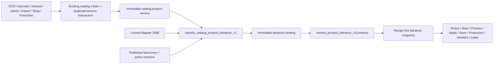

# Unified Product Intelligence

## Canonical concepts

1. **Mapper ingredient** is locked technical reference data. Customer/OCR/import flows never write Mapper.
2. **Catalog product version** is the immutable shared commercial fact snapshot in `global_catalog_product_versions`. The existing owner-scoped `products` row is intake evidence or a private `internal_subproduct`; it is not a second source of resolved behavior.
3. **User product relation** stores private favorite/recent/price/supplier/note/stock information. Private facts are never copied into shared product versions or behavior bindings.
4. **Resolved product behavior** is a server-owned immutable binding plus the result of `resolve_product_behavior_v1(productVersionId, context)`.

This migration path deliberately keeps the existing catalog core/version identifiers. It does not copy those rows into another competing product table.

## One authority chain

The version-insert trigger is the common classification boundary for every source. The classifier is idempotent, fail-closed and service-owned. Unknown family/form/policy remains `UNKNOWN` and creates a consolidated review case.

## Independent dimensions

| Dimension | Examples | Authority |
|---|---|---|
| Provenance | OCR, manual, import, Mapper | immutable version/evidence |
| Catalog verification | verified, manual_unverified, blocked | server catalog gate |
| Runtime eligibility | Base, Main, Topping, Label, Production | behavior binding + resolver context |

Green catalog verification never grants Engine or Main permission by itself.

## Consumer rule

Recipe consumers may read the immutable `ProductBehaviorSnapshot`. They must not infer family, form, Main eligibility, technical mapping or process behavior from a display name, brand, catalog color or nutrition row.

The picker resolves before selection. The recipe store persists the exact snapshot per line and scope. Preview fingerprints it, whole-gram output is rechecked, and Apply compares the current fingerprint. Save and Production carry the same composition metadata. Historical versions read the saved snapshot rather than the latest product binding.

## Scope isolation

- `BASE_FORMULATION` may enter Engine only with approved technical authority.
- `POST_PROCESS_ADDON` never enters POD/PAC/NPAC/ice/Base score/Main optimization/Base Rescue.
- Toppings still contribute actual final mass, nutrition, cost, allergens, ingredient statement and Master Label.
- The same canonical product may occur once per scope; duplicates within one scope merge or focus the existing line.

## Current fail-closed coverage

The exhaustive Mapper report contains all 2,088 rows. Only exact owner-reviewed identities receive provisional policies. Structural categories are `NOT_MAIN`; everything else stays `UNKNOWN_REQUIRES_REVIEW`. This is intentionally incomplete coverage, not inferred science.

The linked staging database must run migrations 0043–0045 and the catalog Edge runtime before service-level catalog counts or served QA can be claimed.
